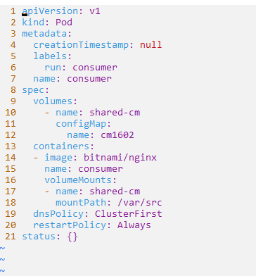

:og:description: Ephemeral Storage: A Hands-On Guide with emptyDir, ConfigMap, and Secret in Kubernetes
:og:image: https://raw.githubusercontent.com/colossus06/kuberada-blog/main/og/ephemeral2.png
:og:image:alt: ephemeral Image

:orphan:


(ephemeral)=
# 🧸 Ephemeral Storage: A Hands-On Guide with emptyDir, ConfigMap, and Secret in Kubernetes

Ephemeral storage refers to temporary, short-lived storage that exists only for the duration of a specific process or container's lifecycle. In containerized environments, such as Kubernetes, on-disk files inside the containers are considered ephemeral. You can create and modify these files but can't preserve when the container is deleted or removed from the node for a reason.

## When to use ephemeral storage

Let's imagine that you're running a dynamic website on a Kubernetes cluster where multiple containers collaborate to deliver a seamless user experience.


- You need storage persistence across container restarts: If your website containers require data consistency you can utilize “emptyDir” volume as a shared space. It will acts as a temporary repository and when the containers restart, the new ones will seamlessly access the same files, maintaining continuity.

- You need a shared space: Multiple containers in your website infrastructure work in tandem, each handling specific functions like content serving, session management, or background tasks. Containers share an "emptyDir" volume, which we will learn how in the hands-on section.

- You need file sharing: Linux's support for arbitrary mounting allows you to flexibly mount volumes at different locations within each container's file system. Users can upload images in the shared "emptyDir" volume. This shared volume is accessible to various containers on the mounted paths, without the need for a separate persistent volume.

- Handling Large Datasets: You can utilize the "emptyDir" volume as an ideal temporary workspace for resource-intensive tasks like sorting large datasets. Even if a container crashes during operations (since the pod isn't removed from the node during a crash), the data in the "emptyDir" volume remains intact. [Reference](https://kubernetes.io/docs/concepts/storage/volumes/#emptydir)


- You want to manage configuration: You may need to inject specific configuration settings to each container. You can leverage ConfigMaps and secrets to inject configuration data into pods, ensuring that all containers have the necessary settings.


## What are various ephemeral volume types

Kubernetes offers various ephemeral volumes and how they are ideal for:

* **emptyDir**: Temporary storage needs in batch processing tasks, enabling data sharing across containers and resilience to container restarts.

* **configMap, downwardAPI, secret**: Applications requiring dynamic configuration or handling sensitive information. These volumes inject data directly into the Pod, ensuring seamless and secure management.

* **CSI ephemeral volumes**: Specialized storage requirements, like high-performance or specific file systems, addressed by dedicated CSI drivers.

* **Generic ephemeral volumes**: Applications needing temporary storage but desiring flexibility in choosing different storage solutions, provided by various compatible storage drivers.


Now that we have taken a look at the various ephemeral storage use cases and types, let's get some hands-on skills that can help us in the Kubernetes exams.

<!-- ## [Hands-on Part]{.bg-warning} -->
## Hands-on With Ephemeral Storage in Kubernetes

*Duration: 15 mins*


If you dont specify a medium for emptydir, it is mounted to the disk by default as you can see in the following example:


Let's try mounting emptyDir volume to the RAM adding a medium. You can find the lab resources on the [kuberada-labs repository](https://github.com/colossus06/kuberada-labs/tree/main/storage-ephemeral).


We created emptydir using disk and memory. 


### emptydir scenario

**Problem Statement**

You are tasked with implementing a shared storage solution named shared-vol in a Kubernetes cluster to facilitate communication and data exchange between two pods. The shared volume should persist as long as the pods are alive.

**Requirements**

- Create a pod named tenants with two containers using the alpine:latest image.
- Ensure that both pods (ct100 and cta150) remain running as long as the tenants pod is active.
- Create a volume named shared-vol, name the first container ct100 and mount the shared volume at /var/www/html.
- Name the second container cta150 and mount the same shared volume at /var/html.
- Inside the ct100 pod, create an index.html file in the mounted volume (/var/www/html) with some content.
- Verify that the cta150 pod can access and list the index.html file from the shared volume (/var/html).

**Expected Outcome**

Upon successful implementation, the ct100 pod should serve as a producer by creating an index.html file, and the cta150 pod should serve as a consumer by displaying the content of the index.html file from the shared volume. This scenario demonstrates the use of shared ephemeral storage to enable communication and data exchange between containers within a Kubernetes pod.


**a quick note on solutions**


```{tip}
  The solution for this task can be found in the [blog's repository](https://github.com/colossus06/kuberada-labs/tree/main/storage-ephemeral). Clone the repo and change directory into storage-ephemeral. Explore the repository to review the codes and files associated with it if you're encountering this task for the first or second time. Remember to attempt solving it without referring to the codes in the repository afterward.
```


**solution**

We will first create a pod spec yaml file and add the second container accordingly. Then navigate to the kubernetes documentation to copy and paste the [emptyDir configuration example](https://kubernetes.io/docs/concepts/storage/volumes/) to declare and mount the volume. For declaration of a volume, we need a name and a type. 


```sh
  volumes:
  - name: shared-vol
    emptyDir {} 
```
 
Pay attention to the paths while mounting.

```sh
    volumeMounts:
    - mountPath: /var/www/html or /var/html
      name: shared-vol
```


Lastly verify that we can access the index.html file from the other containers, cta150 in this case.


### configmap scenario

**Task**

You've been tasked with ensuring smooth configuration management for the 'dev02' team's frontend application. Let's navigate through this scenario:

**Requirements:**

- Create a ConfigMap named 'cm1602' with key-value pairs, configuring essential parameters for the frontend application. This includes 'app=frontend' and 'team=dev02'.
- Introduce a Pod named 'consumer' using the 'bitnami/nginx' image. This Pod will serve as the consumer, leveraging the configuration values - provided by the 'cm1602' ConfigMap.
- Create a volume named shared-cm and mount the ConfigMap as a volume at /var/src.
- Display the  contents on the `/var/src` directory. This step serves as a validation that the configuration values from the 'cm1602'

**Expected Outcome:**

Upon successful implementation of this scenario, the 'consumer' Pod showcases the power of ConfigMaps in Kubernetes. The 'dev02' team's frontend application benefits from seamless configuration, providing a robust foundation for smooth development and operations.


**solution**

For creating a configmap and mounting it as a volume to a container, all we need is to change the type to configMap as shown in the following sections and on kubernetes docs on [Populate a Volume with data stored in a ConfigMap](https://kubernetes.io/docs/tasks/configure-pod-container/configure-pod-configmap/#populate-a-volume-with-data-stored-in-a-configmap).



```sh
  volumes:
    - name: shared-cm
      configMap:
        name: cm1602
```

```sh
    volumeMounts:
    - name: shared-cm
      mountPath: /var/src
```

Let's list the contents of the cm:


### secret scenario

**Problem Statement:**

In the secure realm of the 'secretns102' namespace, you're tasked with deploying a Pod  using the 'nginx' image. The challenge is not just running the Pod but ensuring it securely consumes sensitive information stored in a secret.


**Requirements:**

- Deploy the 'secret' Pod using the bitnami/nginx image within the 'secretns102' namespace. This Pod will serve as a secure environment where sensitive data will be consumed.
- Create a secret named `consumable` on the same namespace from the following key value pairs: psw=admin, user=admin.
- Consume the secret as a volume within the Pod. Name it as you wish
- Mount this secret to the path '/var/src' and ensure it's set with read-only access to safeguard the sensitive information from unauthorized - modifications. 
- Display the contents of the securely mounted secret at '/var/src.'


**Expected Outcome:**

Upon successful implementation of this scenario, the 'secret' Pod in the 'secretns102' namespace stands as a testament to securely consuming and utilizing sensitive information from the 'consumable' Secret. This approach ensures that confidential data remains protected within the Kubernetes environment.

**solution**

We will combine all the above techniques for creating for creating a secret and mounting it as a volume. First we need to change the type to secret and name to secretName as shown in the following snippets. These snippets are taken from the official docs and you can read more on the related section [here](https://kubernetes.io/docs/tasks/inject-data-application/distribute-credentials-secure/#provide-prod-test-creds).


```sh
  volumes:
    - name: shared-secret
      secret:
        secretName: consumable
```


```sh
    volumeMounts:
    - name: shared-secret
        mountPath: "/var/src"
```

Can you list the contents on the directory? Yes!


## Conclusion

Ephemeral storage provides dynamic solutions to challenges like data persistence, collaboration, and configuration management within containerized environments.

In your Kubernetes journey, these hands-on experiences and insights serve as valuable tools. Remember, the ability to navigate ephemeral storage nuances not only prepares you for exams but also equips you to tackle real-world challenges in deploying scalable, resilient, and efficient applications in Kubernetes.