---
myst:
  html_meta:
    "description lang=en": "Craft a robust CI/CD pipeline for Python applications. Leverage GitOps principles for secure deployments, automated testing, and seamless production rollouts using GitHub Actions and Argo CD."
    "keywords": "Kubernetes, hands-on, Gulcan Topcu, Devops, Secure GitOps CI/CD pipeline for Python deployments, cicd, Argo CD, Canary Deployments, GitHub Actions, Terraform, AKS, Argo Rollouts"
    "property=og:locale": "en_US"
    "property=og:image": "https://raw.githubusercontent.com/colossus06/kuberada-blog/main/og/cicd.png"
---


(cicd)=
# Canary Deployments Made Easy: A CI/CD Journey with GitHub Actions and Argo CD Rollouts

```{article-info}
:avatar: https://raw.githubusercontent.com/colossus06/kuberada-blog/main/og/author.png
:avatar-link: ../../../blogs/authors/gulcan.html
:author: Gulcan Topcu
:date: March 24, 2024
:read-time: 15 min read
:class-container: sd-p-2 sd-outline-light sd-rounded-2 sd-shadow-md
```

🏷️**Tagged with:**

```{button-link} ../../../blogs/tag/devops.html
:color: success
:outline:
:shadow:
devops
```

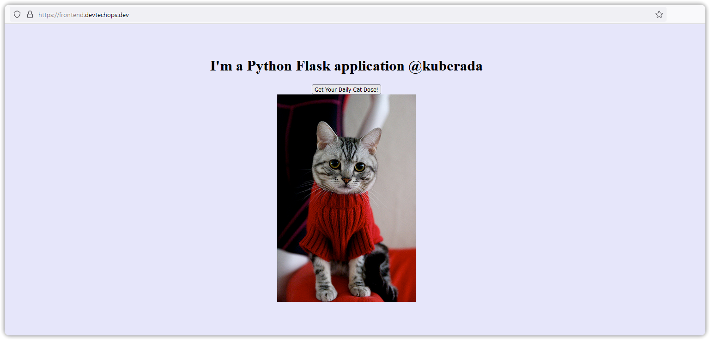

In today's fast-paced development landscape, delivering software updates quickly and reliably is crucial for success. Traditional deployment methods can be slow, error-prone, and require significant manual intervention. So, this article explores how designing a robust CI/CD pipeline built with Argo Rollouts and GitHub Actions, coupled with the power of Kubernetes for container orchestration(AKS), can streamline your DevOps workflow and revolutionize your deployment process.


While we'll focus on Python specifics, the core concepts apply to various programming languages and microservice architectures. The important thing is to understand the core philosophy of designing a CICD workflow and adapting the pipeline to your specific needs, not the tools or language-specific implementations. For instance, the same logic but different tools for integration tests like Jest/Mocha for Node.js, xUnit/SpecFlow for .NET, or adding a compile step before testing and packaging the application for compiled languages like Java, Go, C++...

Our approach offers various benefits, including:

Enhanced Efficiency: Automated repetitive tasks within the CI/CD pipeline free up valuable time and reduce the risk of human error.
Improved Agility: Faster responses to changing market demands with canary deployments using Argo Rollouts enable quicker iteration, safer rollouts, and production and easy rollbacks.
Increased Reliability: Consistent and automated deployments lead to a more stable and predictable software delivery process.

Let's dive into the practical implementation of this approach, showcasing the power of Argo, GitHub Actions, Kubernetes, and Argo Rollouts for a smoother, more efficient, and safer DevOps experience.


## Project Overview

Let's design a scenario together.

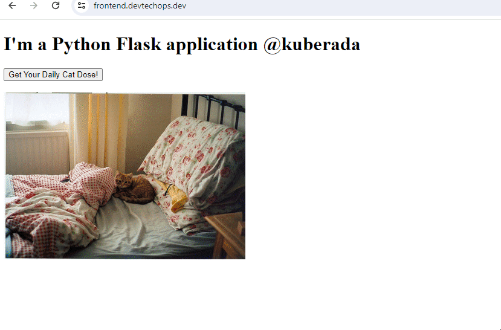

We have a basic Python Flask application on a Kubernetes cluster (AKS). Users come to our application to get their daily cat dose.
While analyzing user feedback gathered in user testing, we discovered that eight out of ten users found static cat images boring and said they would prefer dynamic images or GIFs. As a result, the product owner created a Jira ticket, and a Python developer on the team was assigned to implement the feature of displaying cat images dynamically.

While real-life issues may not always be as simple as we've already highlighted, we aim to practice the philosophy behind designing an automated and secure pipeline, regardless of the intricacy of the issues, languages, or tools.


## First Step: From Local Development

For a better user experience, the Python developer implements a new feature to display cat images dynamically and opens a pull request. As a DevOps engineer, our part is to design an automated and secure pull request pipeline (actually, we will create three pipelines: one for open/updated, one for closed pull requests, and the last one will trigger automatically when we merge to main) and bump up the new version successfully, adopting GitOps principles.

### Prerequisites

- Development Cluster: A cluster for PR reviews.
- Production Cluster: Prod Cluster runs a stable version of our application.
- Image Registry: To store our images privately.

We have deployed a production and test cluster on AKS using Terraform for the prod cluster, deployed and installed Argo CD, argo rollouts, Nginx Ingress, and Cert Manager to encrypt the traffic to our application (Adding an A record for frontend.devtechops.dev pointing to Azure Load Balancer).

We have also set some repository secrets like username, PAT, SSH private key, kubeconfig, and Cat API with custom scripts and Taskfiles.

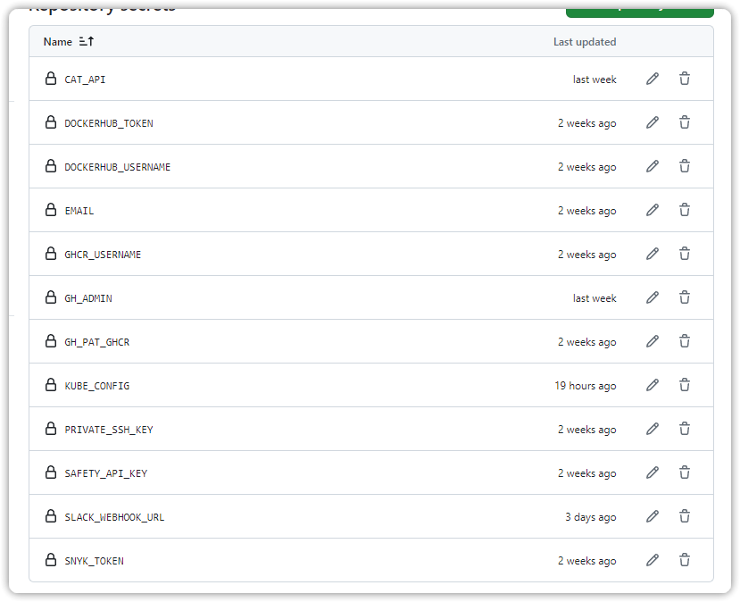

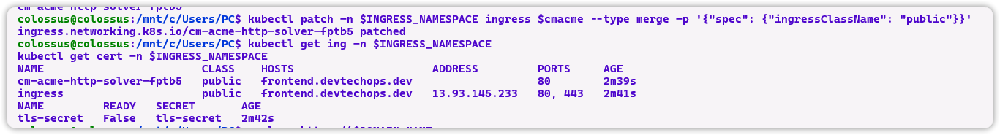

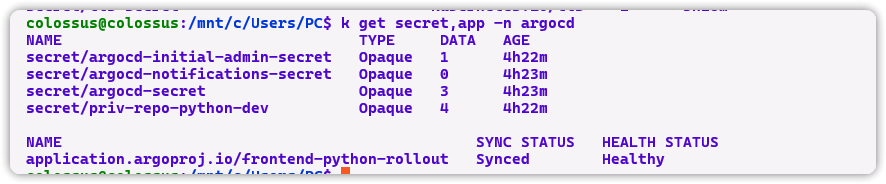

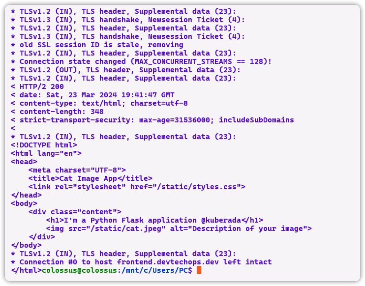


### Tools Preference

Let's take a look at some tools we adopted and the alternatives.

- Pipelines: GitHub Actions. However, you can migrate to tools like Dagger, Azure DevOps, and GitLab CI.
- Temporary Cluster: For this blog, we used another AKS cluster. Some alternatives are Vcluster, KubeVirt, ideal for temporary environments like PR reviews.
- GitOps: Argo CD, alternative options include Flux.
- Production Cluster: AKS. You can also go with EKS GKE.
- Image Registry: GitHub, alternatives are Docker or GitLab, etc.

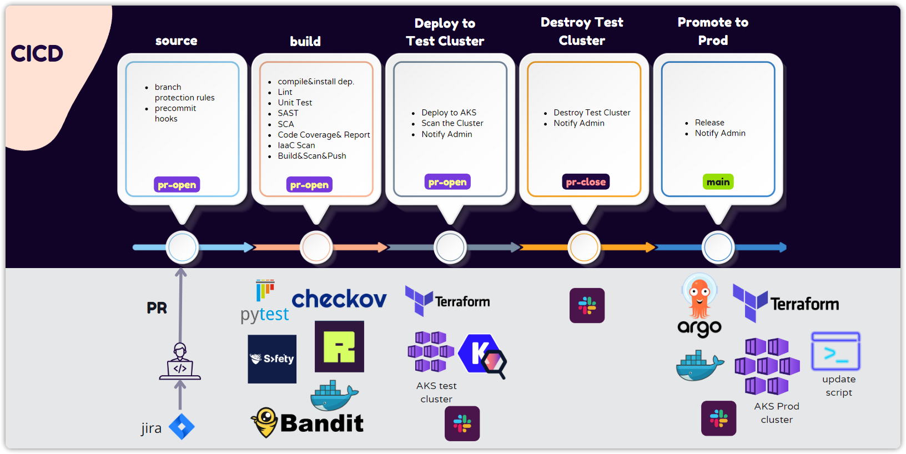

Ready, let's get to action!

## A Rough Look at the Three Pipelines

We should have a system that we can trust and monitor. To achieve this, we have crafted 3 pipelines. Let's take a look at them closely:

- pr-open.yaml: Triggers whenever someone creates or updates a pull request.
- pr-closed.yaml: Triggers when we close/merge the pull request. It destroys the temporary cluster.
- main.yaml: Runs when we close/merge the pull request, updating the release manifest file with the new image tag and promoting the new version of our app to production with a canary deployment strategy.

For each pipeline, Slack notifies us about the result.


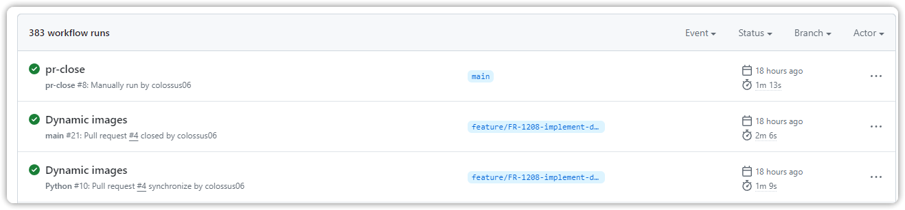

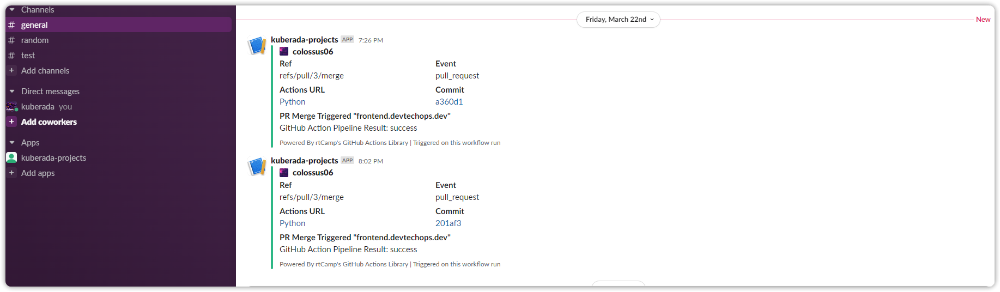

## Pull Request Pipeline


In the PR open pipeline, we perform several checks related to the functionality of the code:


- Ensure the implemented feature works as intended.
- Check for potential errors.
- Ensure code coverage is at least 80% (can be adjusted based on organization standards).
- Verify that sufficient tests cover the new functionality, contributing to code coverage.
- Confirm that the new functionality integrates well with the rest of the application.


If the new feature passes these tests, we scan our infrastructure, images, and Kubernetes manifest files. We containerize our application, authenticate to the release repository, and update manifest files with the fresh image tag.


Finally, we create a temporary Kubernetes preview environment with AKS for the pull request (and each future pull request) for review.

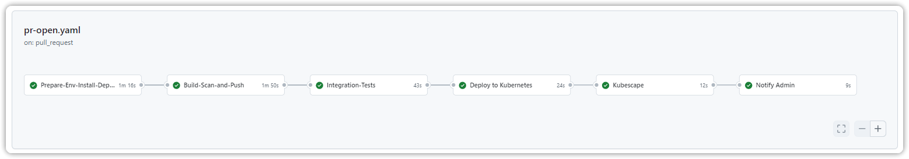

Let's take a look at the steps closer.


### PR: Feature/FR-1206-implement-dynamic-images Branch Created


The initial step in a CI/CD pipeline begins with the developer. After working on the local copy of the code and ensuring satisfaction with the new changes, the developer runs pre-hooks such as tests and linting before committing to the feature branch to catch potential issues early. Once content with the changes, the developer, not Devin (at least for now), opened a lightweight local cluster using k3d to verify that the application works as expected.

Afterward, the developer destroys the local cluster and crafts a pull request.


### Crafting a Pull Request


The developer began by describing the new complex feature and giving a proper name to the feature branch. Additionally, the developer incorporated the issue ID (Jira ticket ID) into the branch name for easier reference. He/She added a commit message and pushed the new changes to the version control system, GitHub, in this case, and opened a pull request.


### Source Stage: Triggering the Pipeline


The `pr-open` pipeline started running remotely on GitHub Actions, checking out the source code from the repository, and the review process began. The type of protection mechanisms we have for the mainline is also worth mentioning.


### Branch Protection


Simple branch protection rules have been implemented on the main branch. A branch protection rule can be set in Settings > Branches > Add Rule. One such rule is "Require a pull request before merging," meaning that direct pushes to the main branch are not allowed.


## Build Stage: Code (Part I)


During the build stage, the focus is simply on testing and detecting any vulnerabilities in the source code. For our Python application, we need to set up Python, install dependencies, and run linters. It is preferred to place SAST analysis early in the pipeline, after unit testing. Once the code is functionally correct, the focus shifts to identifying security vulnerabilities in the codebase and third-party libraries and dependencies using an SCA tool.


### Dependencies vs. Source Code


**Source Code:**

The foundation of your application is the human-readable code you write (e.g., in Python) that defines the application's logic and functionality.


```python
from flask import Flask


app = Flask(__name__)


@app.route('/')
def hello_world():
    return "I'm a Python Flask application @kuberada"


if __name__ == '__main__':
    app.run(debug=True)
```


**Dependencies:**

Reusable pieces of code written by others that your application relies on to function. They can be:
- Libraries: Collections of functions and classes that provide specific functionalities (e.g., Flask for web development in Python).
- Frameworks: Larger collections of code that offer a structure and pattern for building applications (e.g., Django, a Python web framework).

In the example, Flask is a dependency. Your application imports it to use its functionalities.


**Key Differences:**

- Origin: You write the source code, while others write dependencies.
- Focus: Source code defines your application's unique logic, while dependencies provide pre-built functionality.
- Control: You have complete control over your source code but rely on others to maintain and update dependencies.


#### Linting

Linting and SCA complement each other, providing a more comprehensive security posture. Linting primarily deals with code quality, style, and adherence to predefined coding standards. It identifies potential errors, stylistic inconsistencies, and areas for improvement within your codebase. Linters suggests style improvements based on the PEP 8 style guide (for Python). Some tools include Ruff, flake8, Autoflake, Pylint, pycodestyle, and pyflakes.


For testing frameworks, options include Python's built-in unittest framework, pytest, unittest, and nose. Here, we'll use Ruff for its speed and run unit tests (pytest) with coverage.

```yaml
- name: linting
  run: |
      ruff check . -v --fix --output-format=github
      ruff format . -v
```

#### Code Coverage


After running unit tests, we generate a code coverage report (coverage html), which measures how much of the Python code is executed by our tests. This helps ensure that our tests cover a significant portion of our code, reducing the risk of regressions and hidden bugs.

```yaml
- name: Test with pytest
  run: |
    pytest test_kuberada.py -v --cov --cov-report=html
- name: Upload pytest test results
  uses: actions/upload-artifact@v4
  with:
    name: index.html
    path: ./python-flask/htmlcov
```

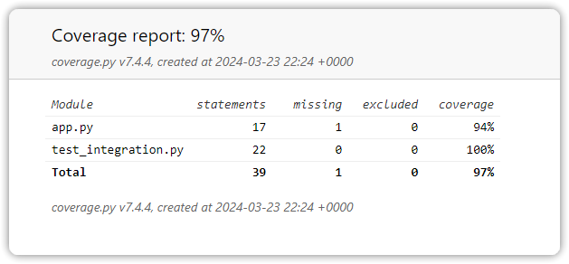

#### Quality Checks


We run quality checks (flake8, pylint, etc.) further to ensure code quality and adherence to coding standards.


#### SAST (Static Application Security Testing)


SAST is placed early in the SDLC before compilation. It analyzes the source code itself, identifying security vulnerabilities in code patterns, coding practices, and potential function misuses. SAST tools focus on analyzing source code in compiled languages, but they can also analyze Python code for patterns that might indicate potential security vulnerabilities.


#### SCA (Software Composition Analysis)


SCA keeps track of every open-source component within an application's codebase. It scans project dependencies (libraries, frameworks) for known vulnerabilities. SCA can run before the build to identify potential issues early on or during the build process to ensure secure dependencies. Safety (rebranded from PyUp) is a tool we'll use for SCA in this case.

```yaml
- name: SCA analysis
  uses: pyupio/safety@2.3.4
  with:
  api-key: ${{secrets.SAFETY_API_KEY}}
```

## Build-Stage-Container-(Part-II)


After ensuring the security of our code, the next step is to scan our Dockerfile and build our image.


### IaaC Scan

Dockerfiles can inherit vulnerabilities from base images or dependencies. Infrastructure as Code (IaaC) scanners identify these vulnerabilities and alert us to potential security risks within our containerized application. Some popular IaaC scanners include Snyk (free/paid), Aqua Trivy (free/paid), Anchore Engine (paid), Docker Hub Security Scanning (free-basic), docker-scout, and claire.

```yaml
- name: Run Trivy vulnerability scanner
  uses: aquasecurity/trivy-action@master
  with:
      image-ref: ${{ env.repo }}:canary-pr-${{ env.pr_num }}
      format: 'github'
      exit-code: '1'
      ignore-unfixed: true
      vuln-type: 'os,library'
      severity: 'CRITICAL,HIGH'
- name: Upload trivy report as a Github artifact
  uses: actions/upload-artifact@v4
  with:
      name: trivy-sbom-report
      path: '${{ github.workspace }}/dependency-results.sbom.json'
```


After receiving the results, we fix any vulnerabilities and push the image to our private GitHub Container Registry.


### Integration Tests-Check Functionality


Before deploying our application to the development cluster, we must thoroughly test its functionality. In the case of a microservices e-commerce app, this would involve testing dependencies such as payment, checkout, and database functionality. We would run our integration tests in the development Kubernetes cluster based on the application and organizational needs.


For our small application, we added tests to simulate a user clicking the button and tested if the application successfully calls the cat API if the image renders correctly, and if multiple clicks render new images.


Feel free to add more tests as needed for your application.


### Pull Request Pipeline Further Considerations


We can add more tests on the running cluster, such as:


- Simulating real-world user workflows with E2E tests using tools like Cypress or Selenium.
- Load/performance tests to check how the new functionality affects resource consumption (CPU, memory, network) on the cluster, using tools like JMeter, K6, or Locust or by simulating real-world traffic.
- Performing Chaos Engineering tests to introduce failures such as node restarts or network disruptions and monitoring how our application and cluster react.
- Integrate tools like Burp Suite or OWASP ZAP for Dynamic Application Security Testing (DAST) if the application is complex with many dependencies and has various functionalities. However, DAST might be considered overkill for a small application like ours with a limited attack surface.


### Deploying the New Version to the development Cluster


Once security scans, unit, and integration tests provide a good level of confidence in the functionality and stability of the new code, we deploy our app to a development cluster that lives as long as the pull request (PR) is open. This environment is ephemeral and only available for testing and reviewing.

At this step, you can run whichever tests you want to run.


The only test we will perform at this step is scanning our running cluster using Kubescan and uploading the results as HTML artifacts.


Now, the team members can review the application.

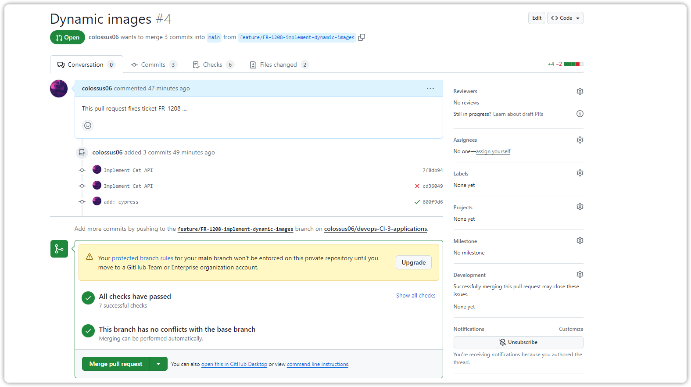

Once we merge the application, the `pr-close.yaml` and main.yaml pipelines trigger. `pr-close.yaml` deletes the development cluster and notifies admin that the pr is merged. On the other hand, since we push some new code to the main line, main.yaml also triggers and promotes the new version to production.


Let's take a closer look at the main workflow.

## Main Pipeline: Continuous Deployment


Once we merge the pull request, the main pipeline bumps up the version and deploys the new version to production.


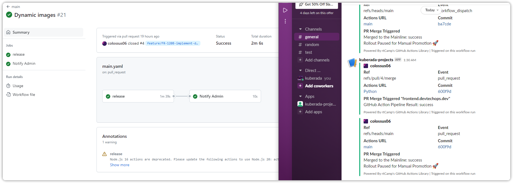

In this step, we containerize our application, push it to the registry, and commit the updated tags to our release manifests. We don't interact with the production cluster directly; instead, Argo CD is in control and ensures that the desired state (our release repo with newly updated tags) matches the application running in production.


Instead of directly promoting to prod, we use a canary deployment strategy to release code safely. First, we send 20% of traffic to a small canary group and then pause the process to monitor the group. If everything works well, we manually promote the new version to prod.

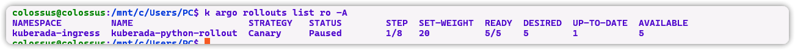

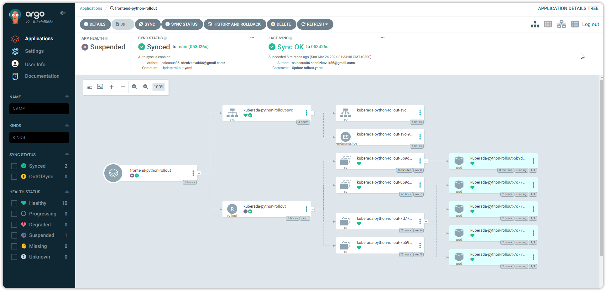


Finally, the traffic increases gradually until no pod is left from the earlier version of the application, which means that the weight reaches 100% and the rollout is completed successfully.

If problems arise, Argo also allows easy rollback to a previous version in the history.


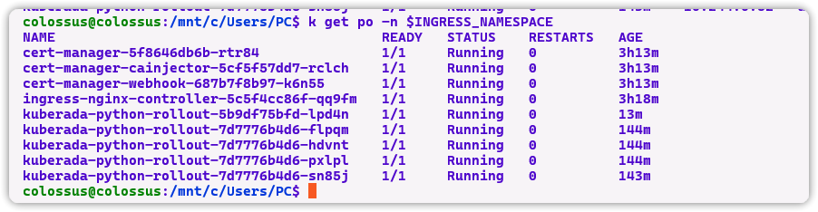

At this stage, you can do some more tests on the pod such as port forwarding and checking if the app is functional, checking the logs.

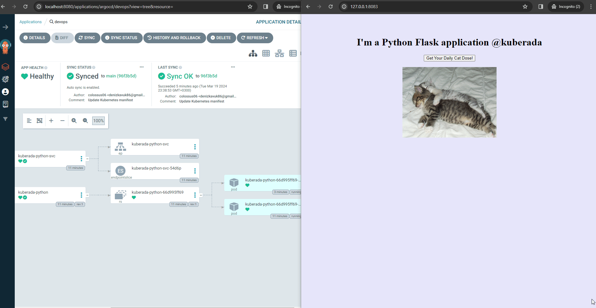

Since everything is functional as we expect, we can promote the app to production manually.

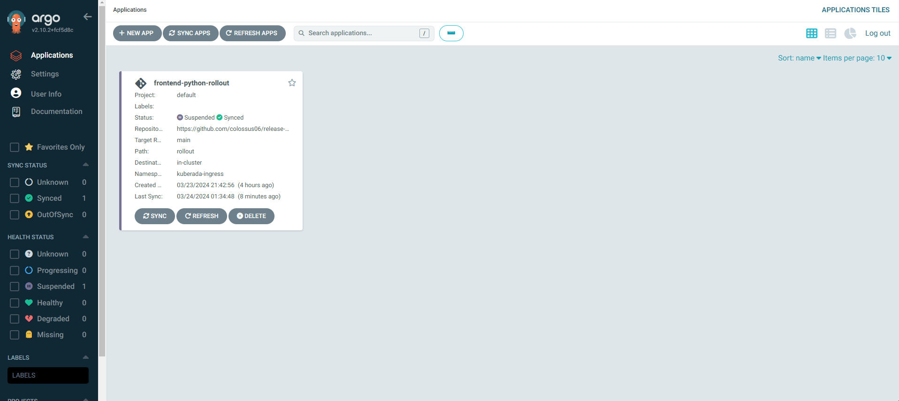

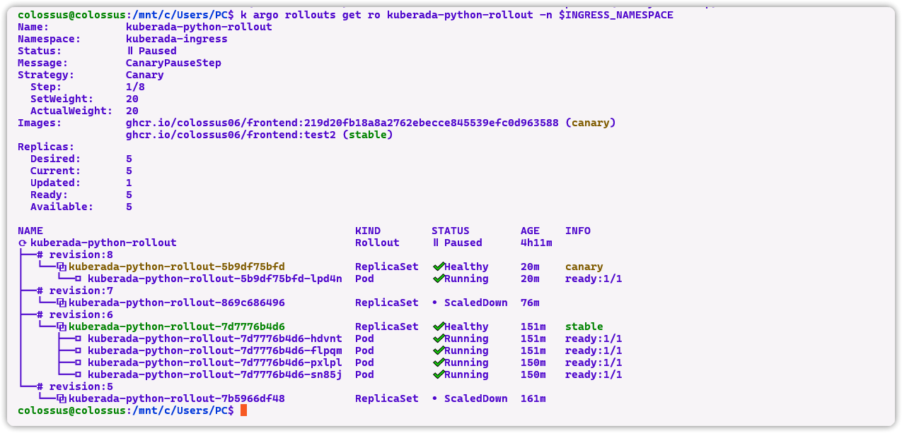

### Best Practices for Secure CI/CD Pipelines: A GitOps Approach


Here are some best practices we should adopt while designing the CI/CD pipeline:


- Clear PR Descriptions: Always explain changes in PR descriptions, including details on implemented security measures.
- Local Development Checks: Encourage developers to run linters, unit tests, and security scans on their local machines throughout development.
- Coding Practices & Static Analysis: Adopt good coding practices and secure coding principles. Integrate static analysis tools to improve code quality security posture and identify vulnerabilities early.
- Security is Ongoing: Security is an essential part of the entire development lifecycle, not just an afterthought. Even simple applications deserve a high level of security attention.
- GitOps Principles: Infrastructure and application configurations are stored as code within our Git repository, enabling declarative (not manual) deployments and automatic rollbacks with Argo.


### Future Optimizations:

Our pipeline paves the way for a more agile and efficient software delivery process, but additional avenues exist for continuous improvement.


* Enhanced Testing: Depending on your project needs, consider adding more robust tests like Regression, Performance, API, and E2E testing...
* Monitoring & Logging: Implement a comprehensive monitoring and logging stack for proactive issue identification and alerting using tools like ELK, Prometheus, Grafana, DataDog, New Relic, and Robusta.
* Cost Optimization: Explore cost optimization strategies to ensure efficient resource utilization using tools like cluster autoscaler, Azure Container Insights, HPA, multi-tenancy options, kubecost, analyzing/monitoring important pod, control plane, node, and application metrics.
* Code Caching & Dependency Pre-installation: Utilize code caching and dependency pre-installation techniques to speed up the build process.
* Parallel Builds: For larger projects, consider implementing parallel builds to improve pipeline execution.

## Conclusion

From Local Feature to Production (Securely), here's a breakdown of what we accomplished with a secure GitOps-based CI/CD pipeline for our application:

We implemented a fully automated CI/CD pipeline leveraging GitOps principles, prioritizing security throughout the process. Our only manual step was to promote the application to prod manually during the canary deployment. All infrastructure and application configurations are stored as code within our Git repository.

As DevOps continues to evolve, leveraging these tools positions you for success in the ever-changing development landscape. Take control of your DevOps workflow and feel the power of automation. Adopting the philosophy, not the tools, is important because they come and go.


Happy coding👩‍💻


Take a look at the brief overview of the [Case study](https://www.devtechops.dev/portfolio/canary-deployments-made-easy-a-cicd-journey-with-github-actions-and-argo) on my website.

## References

Here are the links to the tools mentioned in your document:
- [Cat as a Service](https://thecatapi.com/)
- [Argo Rollouts](https://argoproj.github.io/rollouts/)
- [GitHub Actions](https://github.com/features/actions): GitHub's CI/CD platform for automating workflows.
- [Argo CD](https://argoproj.github.io/argo-cd/): Declarative, GitOps continuous delivery tool for Kubernetes.
- [Terraform](https://www.terraform.io/): Infrastructure as Code (IaC) tool for building, changing, and versioning infrastructure safely and efficiently.
- [AKS (Azure Kubernetes Service)](https://azure.microsoft.com/en-us/services/kubernetes-service/): Managed Kubernetes service provided by Microsoft Azure.
- [Docker](https://www.docker.com/): Platform for developing, shipping, and running applications in containers.
- [Flask](https://flask.palletsprojects.com/): Lightweight WSGI web application framework in Python.
- [NGINX](https://www.nginx.com/): High-performance web server, reverse proxy, and load balancer.
- [Cert Manager](https://cert-manager.io/): Automated certificate management in Kubernetes.
- [Kubernetes](https://kubernetes.io/): Open-source container orchestration platform for automating deployment, scaling, and management of containerized applications.
- [Python](https://www.python.org/): High-level programming language used for web development, data science, and more.
- [Cypress](https://www.cypress.io/): End-to-end testing framework for web applications.
- [Selenium](https://www.selenium.dev/): Portable framework for testing web applications.
- [JMeter](https://jmeter.apache.org/): Open-source tool for load testing and performance measurement.
- [K6](https://k6.io/): Open-source load testing tool and SaaS for engineering teams.
- [Locust](https://locust.io/): Open-source load testing tool.

These links should provide more information about each tool and how to use them effectively in your CI/CD pipeline.

<!-- <p id="quote-container"> </p> -->

👉 For a wealth of knowledge, check our blog archives.
Happy reading! 📚✨


<div style="text-align: center;">
  <h2>Did you like kuberada? 🐶 </h2>
</div>

<br>

<div class="sharethis-inline-reaction-buttons"></div>


   


