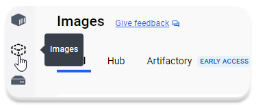
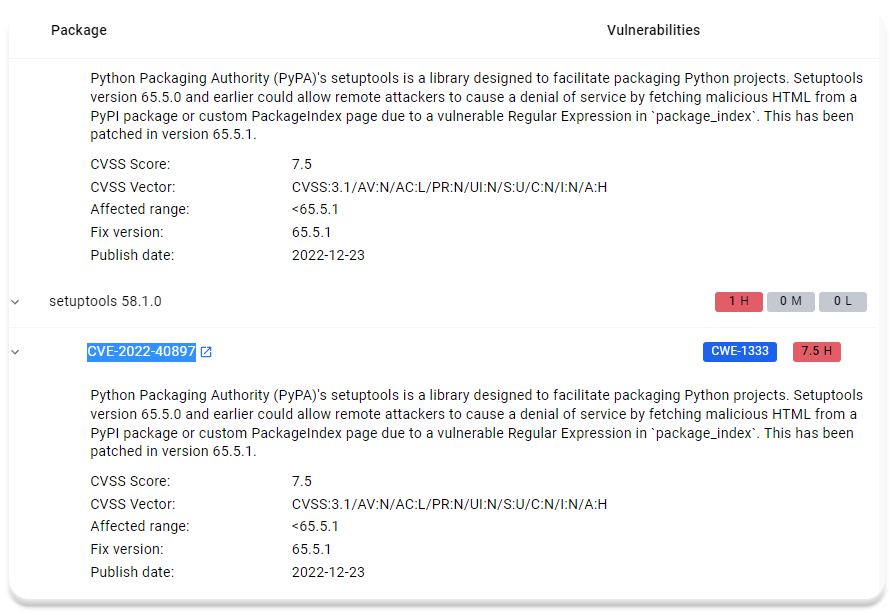

---
myst:
  html_meta:
    "description lang=en": "Description: Explore a comprehensive guide on securing Docker images using Docker Scout, a powerful security tool by Docker. Learn to scan, identify, and address vulnerabilities, minimizing risks in production environments"
    "keywords": "Docker, Docker Scout, Security, Vulnerabilities, Production Environment, CVE, Image Scanning, Image Security, Practical Guide, Containerization, DevOps, Software Security, Cybersecurity."
    "property=og:locale": "en_US"
    "property=og:image": "https://raw.githubusercontent.com/colossus06/kuberada-blog/main/og/docker-scout.png"
---


(docker-scout)=
# Securing Docker Images with Docker Scout: A Practical Guide

```{article-info}
:avatar: https://raw.githubusercontent.com/colossus06/kuberada-blog/main/og/author.png
:avatar-link: ../../../blogs/authors/gulcan.html
:author: Gulcan Topcu
:date: Feb 1, 2024
:read-time: 10 min read
:class-container: sd-p-2 sd-outline-light sd-rounded-2 sd-shadow-md
```
🏷️**Tagged with:**

```{button-link} ../../../blogs/tag/container.html
:color: success
:outline:
:shadow:
container
```

Ensuring the security of Docker images is vital for maintaining the overall security posture of your organization. Docker Scout, a security tool developed by Docker, excels in scanning Docker images for potential vulnerabilities and provides valuable recommendations to enhance image security. In this blog post, we will guide you through the process of leveraging Docker Scout to scan and secure Docker images. Join us as we learn to scan, identify, and address vulnerabilities in container images, effectively minimizing risks in production environments while aligning with cloud-native security practices.

## Introducing Vulnerable Python Image

If you've been following our articles on Kuberada, you're likely aware that we've built three custom images for our voting app, stored on Dockerhub and Gitlab repositories. With a security-focused mindset, our goal is to assess whether these images are affected by critical CVE vulnerabilities.


Before delving into the assessment, let's briefly understand what CVE entails.

**What is CVE?**

CVE (Common Vulnerabilities and Exposures) is a standardized system designed for uniquely identifying and naming vulnerabilities in software and hardware systems. Maintained by the MITRE Corporation, CVE provides a common language for organizations and security practitioners to discuss, share, and exchange information about security vulnerabilities.

## Analyzing Python Frontend Application for Vulnerabilities

To begin, open Docker Desktop and navigate to the images section. Docker Scout is already enabled on Windows Docker Desktop.




As a quick reminder, we created our images using the following commands:

```sh
docker buildx create --name mybuilder --use --bootstrap
DOCKER_IMAGE_NAME=registry.gitlab.com/colossus06/cka-ckad-study-group-2024/frontend_python
docker buildx build --load --platform linux/amd64 -t $DOCKER_IMAGE_NAME:fixed .
```

Let's inspect the packages added to each layer of our image and identify any software package affected by critical vulnerabilities.


While there are no critical vulnerabilities, we notice two high vulnerabilities stemming from the same CVE, `CVE-2022-40897`. Docker Scout recommends upgrading the setuptools version to `65.5.1` to address this issue. Let's proceed with the upgrade.



First, detect the current vulnerable package version:

```sh
pip list | grep setup
```


Now, let's upgrade the package:

```sh
pip install setuptools --upgrade
pip freeze > requirements.txt
echo "setuptools==$(pip show setuptools | grep Version | cut -d ' ' -f 2)" >> requirements.txt
```


Rebuild the image:

```sh
docker buildx build --load --platform linux/amd64 -t $DOCKER_IMAGE_NAME:fixed .
```


## Verifying the Fix for `CVE-2022-40897`

Inspect the layers of the latest image:


## Getting Recommendations to Harden the Base Image

While we've addressed specific vulnerabilities, there are still medium vulnerabilities originating from the base image. Docker Scout's recommendation engine can help rectify this.

Navigate to recommended fixes in the top right corner.


## Applying the Recommendations

To eliminate 26 vulnerabilities and save 28 MB of space, we need to change the base image. Replace `FROM python:3.9-slim AS base` with `FROM python:alpine` in the Dockerfile and adjust the package manager.

```sh
FROM python:alpine AS base
RUN apk add --update curl && \
    rm -rf /var/cache/apk/*
```

Rebuild the image:

```sh
docker buildx build --load --platform linux/amd64 -t $DOCKER_IMAGE_NAME:base-hardened .
```


Finally, inspect the latest image using Docker Scout:


## Tagging and Pushing Images to Dockerhub

Tag the first image before fixing critical vulnerabilities and the latest push.

```sh
DOCKER_NEW_IMAGE_NAME=elkakimmie/docker-scout
docker tag $DOCKER_IMAGE_NAME:latest $DOCKER_NEW_IMAGE_NAME:vuln
docker tag $DOCKER_IMAGE_NAME:base-hardened $DOCKER_NEW_IMAGE_NAME:base-hardened
docker push $DOCKER_NEW_IMAGE_NAME:vuln
docker push $DOCKER_NEW_IMAGE_NAME:base-hardened
```

Now, there are two images available:

- `elkakimmie/docker-scout/vuln`: The initial image with vulnerabilities.
- `elkakimmie/docker-scout/base-hardened`: The latest image after fixing CVE-2022-40897 and changing the base image to Alpine.

## Activating Image Analysis on Scout

Scout image analysis is already available by default for Docker Hub repos. You can find it in your repository settings.


Alternatively, activate it on Scout repository settings. As of Feb 1, 2024, you can activate analysis for three repositories under the Docker Scout Free plan.


Once activated, Scout automatically analyzes images upon push, displaying `SCOUT ANALYSIS ACTIVE` in your repository/general tags section.


## Comparing Images

You can compare images using Scout GUI or the docker-scout CLI.

**Comparison on Scout**

Navigate to [Scout](https://scout.docker.com/), locate your repository in the images section, and compare the two images.


Verify the removal of 29 low vulnerabilities.


**Comparison using docker-scout CLI**

Compare two images and display differences using the following commands. Consider piping the output to `less`.

```sh
docker login
docker scout config organization <dockerhub-username>
docker scout compare $DOCKER_NEW_IMAGE_NAME:base-hardened --to $DOCKER_NEW_IMAGE_NAME:vuln --ignore-unchanged
```


**Analyzing Images Locally**

Inspect images locally using the following command:

```sh
docker scout quickview $DOCKER_NEW_IMAGE_NAME:base-hardened
```

**BONUS-1: Upgrading Docker Scout on Windows WSL**

Execute the following script in your terminal to upgrade Docker Scout on Windows WSL:

```sh
curl -sSfL https://raw.githubusercontent.com/docker/scout-cli/main/install.sh | sh -s --
docker scout version
```


**BONUS-2: Fixing error storing credentials**

If you encounter the following error, try removing `~/.docker/config.json`:

```sh
Error saving credentials: error storing credentials - err: fork/exec /usr/bin/docker-credential-desktop.exe: exec format error, out: ``
```

## Conclusion

To recap, securing Docker images is a critical aspect of maintaining a robust and resilient production environment. Docker Scout proves to be a valuable tool in identifying and addressing vulnerabilities effectively. By following the practical guide outlined in this article, you have gained hands-on experience in securing Docker images, making the production workloads more resilient to potential threats.

### References

- [Docker Scout CLI Releases](https://github.com/docker/scout-cli/releases/tag/v1.3.0)
- [Docker Scout demo by James Spurin](https://www.youtube.com/watch?v=2sY7z2yv_5Y)
- [Docker Scout quickstart by Christian Dupuis](https://docs.docker.com/scout/quickstart/)
- [Sysdig and Docker Forge Alliance to Accelerate Cloud-Native Security: Docker Scout](https://medium.com/@seifeddinerajhi/sysdig-and-docker-forge-alliance-to-accelerate-cloud-native-security-16f6fec74327)
- [MITRE Corporation - Common Vulnerabilities and Exposures (CVE)](https://cve.mitre.org/)
- [Docker Desktop Documentation](https://docs.docker.com/desktop/)
- [Alpine Linux Package Management](https://wiki.alpinelinux.org/wiki/Alpine_Linux_package_management)
- [Docker Official Documentation](https://docs.docker.com/)
- [Scout Image Analysis Documentation](https://docs.docker.com/scout/image-analysis/)
- [Containerization Best Practices](https://www.docker.com/blog/containerization-best-practices/)

Happy upskilling!


👉 For a wealth of knowledge, check our blog archives.
Happy reading! 📚✨


<div style="text-align: center;">
  <h2>Did you like kuberada? 🐶 </h2>
</div>

<br>

<div class="sharethis-inline-reaction-buttons"></div>