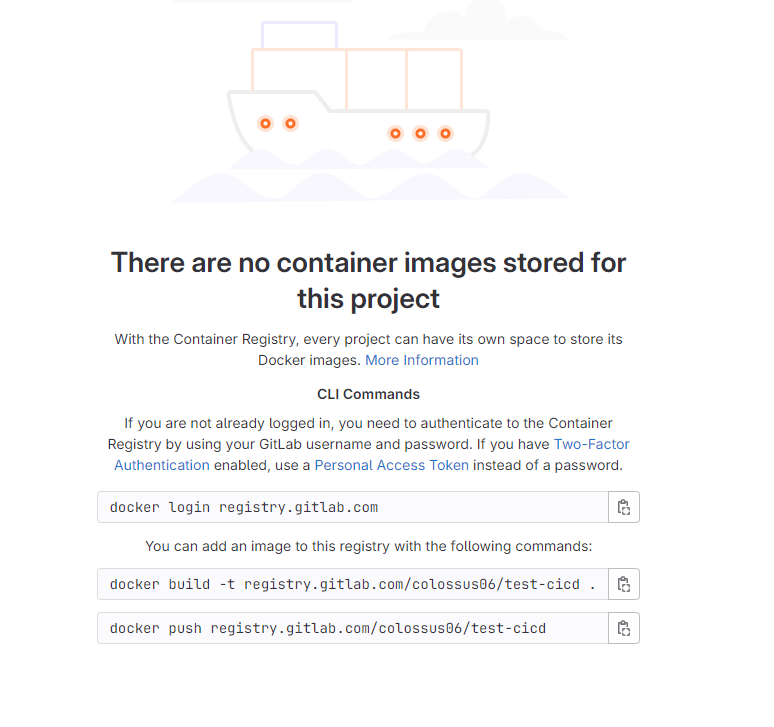
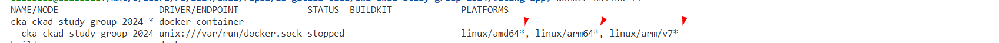
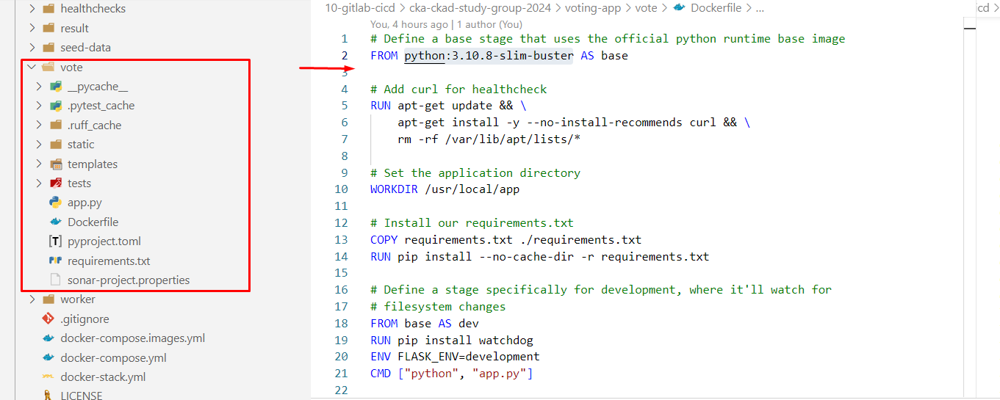
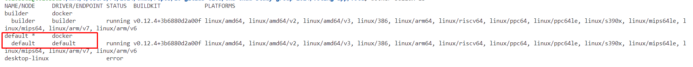
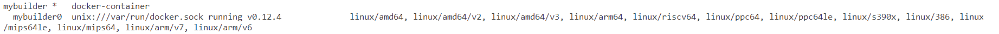
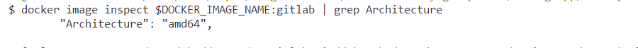
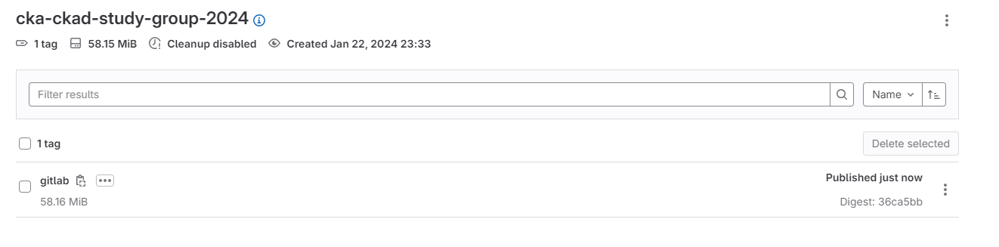
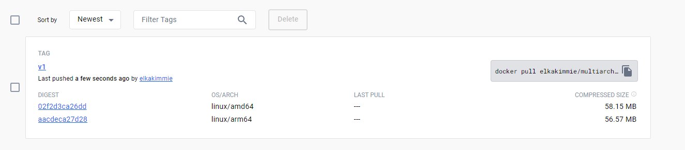

---
myst:
  html_meta:
    "description lang=en": "Dive into GitLab Container Registry using the powerful buildx tool. Securely locate, authenticate, and build Docker images with our step-by-step guide. Uncover the capabilities of buildx recommended by GitLab and optimize your container building process."
    "keywords": "Kubernetes, hands-on, Gulcan Topcu, Devops, Gitlab, container registry, buildx, multi-arch build"
    "property=og:locale": "en_US"
    "property=og:image": "https://raw.githubusercontent.com/colossus06/kuberada-blog/main/og/gitlab-container-registry.png"
---


(container-registry)=
# Mastering GitLab Container Registry with Buildx: Your Comprehensive Guide

```{article-info}
:avatar: https://raw.githubusercontent.com/colossus06/kuberada-blog/main/og/author.png
:avatar-link: ../../../blogs/authors/gulcan.html
:author: Gulcan Topcu
:date: Jan 20, 2024
:read-time: 10 min read
:class-container: sd-p-2 sd-outline-light sd-rounded-2 sd-shadow-md
```
🏷️**Tagged with:**

```{button-link} ../../../blogs/tag/devops.html
:color: success
:outline:
:shadow:
devops
```

In this article, we'll guide you through the process of getting started with GitLab Container Registry using the powerful `buildx` tool. Follow the steps below to locate the container registry, authenticate securely, and build your Docker image.

## Table of Contents
- Locating Container Registry
- Authenticating to the Registry
- Tagging and Building the Image using Buildx

## Locating Container Registry

1. Navigate to your project in GitLab.
2. Select the "Deploy" option from the project menu.
3. Click on "Container Registry." You'll be directed to a blank page with instructions.



## Authenticating to the Registry

To securely authenticate with GitLab Container Registry, follow these steps:

`docker login $CI_REGISTRY -u <username> -p <access_token>`

* dockerhub: `https://index.docker.io/v1`
* gitlab ci: `registry.gitlab.com`

```bash
docker login registry.gitlab.com
```
Avoid using your password; instead, use a personal access token. Here's how you can generate one:

- Go to your GitLab profile.
- Navigate to "Access Tokens" under "Edit Profile."
- Add a new token with a name of your choice.
- Set the scope to `read_registry` (for pull access) and `write_registry` (for push rights).

After generating the token, remove the existing entry in `$HOME/.docker/config.json` related to GitLab:

```json
{
    "auths": {
        "registry.gitlab.com": {}
    },
    "credsStore": "desktop.exe"
}
```

Authenticate again using your personal access token:

```bash
docker login registry.gitlab.com
```

## Tagging and Building the Image using Buildx

### Tagging the Image

Here is the structure of tagging an image to push to the registry:

```bash
tag=registry.gitlab.com/<gitlab-username>/<project-name>
```

### Why Buildx?

GitLab recommends using `buildx` for building container images due to its enhanced features and capabilities compared to the traditional `build` command. You can read more on multi-platform images using buildx [here](https://docs.docker.com/build/building/multi-platform/). Let's take a look at how to properly tag the image for pushing.

### What is a Builder?

A builder is a tool that uses BuildKit, a build engine, to carry out your builds. BuildKit interprets the instructions in a Dockerfile to generate a container image or other outputs.

You can interact with the builders using the `docker buildx ls` command. The asterisk (*) marks the selected platforms for the image:



Now, let's clarify the difference between `docker build` and `docker buildx build`:

- `docker build`: The classic Docker build command for building images, suitable for single-platform builds.

- `docker buildx build`: An advanced version using BuildKit, offering extra features like multi-arch builds and advanced options for a more flexible and capable building process.

**BuildKit** is the underlying build engine that powers these builders. It efficiently processes the build steps in a Dockerfile to produce the desired container image or other artifacts.

### Building the Image

Change the directory to your application code where the Dockerfile resides and create a builder instance:



```bash
export DOCKER_IMAGE_NAME=registry.gitlab.com/colossus06/cka-ckad-study-group-2024
docker buildx ls
docker buildx create --name mybuilder --use
docker buildx inspect --bootstrap
```

We can see that the default builder is mybuilder:





**Automatic Load with Buildx**

It's time to start a build from our builder we created in the previous step. We will use `--push` to automatically push our multi-platform build result to GitLab Container Registry, and BuildKit will assemble the image manifest for the target architectures.

```bash
cd <Dockerfile-directory>
docker buildx build --load --platform linux/amd64 -t $DOCKER_IMAGE_NAME:gitlab .
```

Now we can see that our builder is registered:

Display our image:

```bash
docker image inspect $DOCKER_IMAGE_NAME:gitlab | grep Architecture
```

**Expected output:**



**Displaying the Image on GitLab Registry**

Run the following command to push your image to the GitLab Container Registry:

```bash
docker push $DOCKER_IMAGE_NAME:gitlab
```

Display your registry by navigating to the following URL:

`https://gitlab.com/<gitlab-username>/<repo-name>/container_registry/` or `project/deploy/container_registry`



**Editing the Builder Instance**

If you wanr to delete the builder instance, run the following:

```bash
docker buildx rm mybuilder
```

Creating a new builder:

```bash
docker buildx create --use --name voting-app
docker buildx build --load --platform linux/amd64 -t $DOCKER_IMAGE_NAME:gitlab .
```

Let's put together all the commands we used:

```bash
docker buildx rm mybuilder
docker buildx ls
docker buildx create --use --name voting-app
docker buildx inspect --bootstrap
docker buildx build --load --platform linux/amd64 -t $DOCKER_IMAGE_NAME:gitlab .
docker push $DOCKER_IMAGE_NAME:gitlab
```

## Final Words

In this hands-on blog post, we have authenticated, built, and pushed our Docker image to GitLab Container Registry using `buildx`.

**Challenges:**

Here are two challenges for you.

1. Can you build and push a multi-arch image to GitLab and Docker Hub?

Try also authenticating to Docker Hub, build a multi-arch image, and push it to the Docker Hub Container Registry:

```bash
docker login -u <dockerhub-username> -p <password>
docker buildx build --push --platform linux/amd64,linux/arm64 -t <dockerhub-username>/multiarch:v1 .
```



2. Can you save some space by keeping only 5 tags per image?

### References

- [GitLab Container Registry Documentation](https://docs.gitlab.com/ee/user/packages/container_registry/)
- [Docker Documentation](https://docs.docker.com/)
- [Docker Buildx Documentation](https://github.com/docker/buildx)
- [GitLab Documentation](https://docs.gitlab.com/)
- [Docker Hub Documentation](https://docs.docker.com/docker-hub/)
- [Docker Access Tokens](https://docs.docker.com/docker-hub/access-tokens/)
- [Docker Multi-Platform Builds](https://docs.docker.com/buildx/working-with-buildx/)
- [Docker BuildKit Documentation](https://docs.docker.com/engine/reference/builder/)
- [GitLab Multi-Architecture Images](https://docs.gitlab.com/ee/ci/docker/using_docker_build.html#use-docker-buildx-to-create-multi-platform-builds)

Happy building!

**Enjoyed this read?**

If you found this guide helpful,check our blog archives 📚✨

- Follow me on [LinkedIn](https://www.linkedin.com/in/gulcantopcu/) to get updated.
- Read incredible Kubernetes Stories: [Medium](https://medium.com/@gulcantopcu)
- Challenging projects: You're already in the right place.

Until next time!
