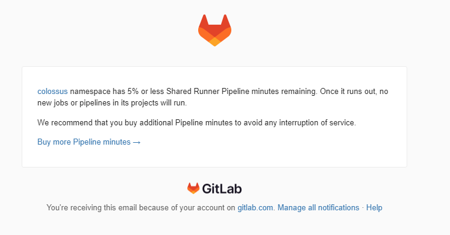
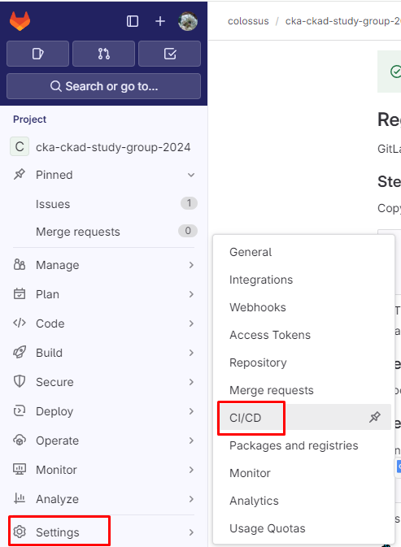
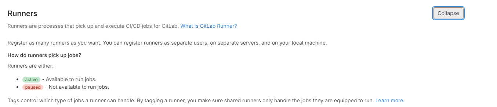
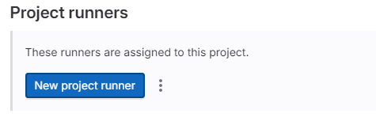
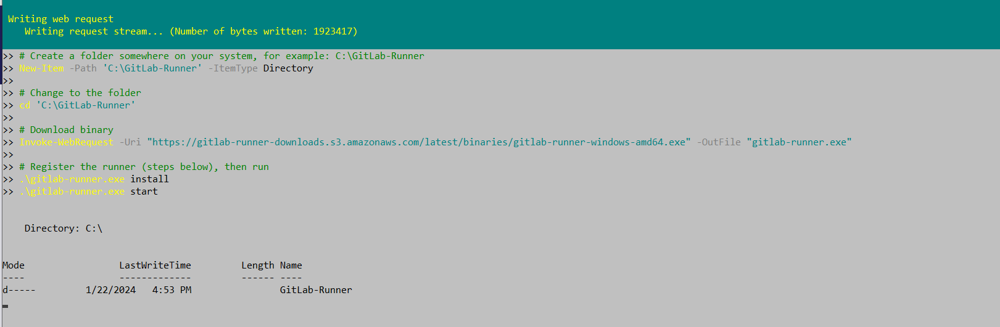
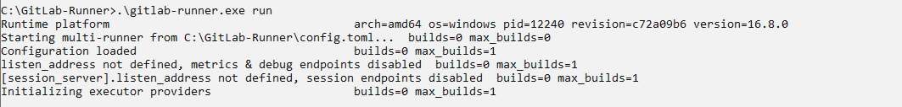
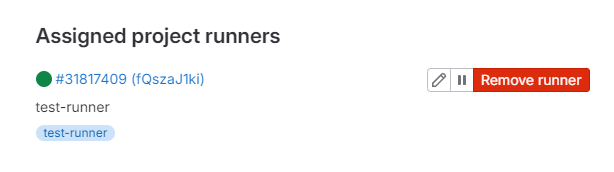

---
myst:
  html_meta:
    "description lang=en": "Learn how to install and configure GitLab Runner on Windows for seamless CI/CD workflows. Follow our comprehensive guide with practical examples"
    "keywords": "Kubernetes, hands-on, Gulcan Topcu, Devops, Gitlab, gitlab runner, cicd"
    "property=og:locale": "en_US"
    "property=og:image": "https://raw.githubusercontent.com/colossus06/kuberada-blog/main/og/gitlab-runner.png"
---


(gitlab-runner)=
# Getting Started with GitLab Runner on Windows - Step-by-Step Guide

```{article-info}
:avatar: https://raw.githubusercontent.com/colossus06/kuberada-blog/main/og/author.png
:avatar-link: ../../../blogs/authors/gulcan.html
:author: Gulcan Topcu
:date: Jan 26, 2024
:read-time: 5 min read
:class-container: sd-p-2 sd-outline-light sd-rounded-2 sd-shadow-md
```

🏷️**Tagged with:**

```{button-link} ../../../blogs/tag/devops.html
:color: success
:outline:
:shadow:
devops
```

Did you happen to receive an email notification from GitLab starting with "namespace has 5% or less Shared Runner Pipeline minutes remaining" 😄? This email underscores the criticality of managing your Shared Runner Pipeline minutes. To optimize your CI/CD (Continuous Integration/Continuous Deployment) processes, it's crucial to understand and utilize GitLab Runners effectively.



**In this page**

- GitLab Runner types?
- Locating GitLab Runner
- Step-by-step installation guide

## GitLab Runner Types

GitLab Runners come in two types: **Specific Runners** and **Shared Runners**.

**Specific Runners** are dedicated to a single project and can only run jobs for that specific project. Conversely, **Shared Runners** are available to all projects within a GitLab instance, providing a versatile and shared resource for CI/CD processes.

## Locating GitLab Runner

To locate GitLab Runner in your GitLab account, follow these steps:

1. Open your GitLab account and navigate to **Settings**.
   

2. In the Settings menu, find the **CI/CD** section.
   

3. Expand the **Runners** section.
   

Now that we know where to find the runners, let's proceed with the installation.

## Step-by-Step Installation Guide

### Step 1 - Install `gitlab-runner.exe`

Open PowerShell with administrative privileges and execute the following commands:

```powershell
# Create a folder for GitLab Runner
New-Item -Path 'C:\GitLab-Runner' -ItemType Directory

# Change to the folder
cd 'C:\GitLab-Runner'

# Download GitLab Runner binary
Invoke-WebRequest -Uri "https://gitlab-runner-downloads.s3.amazonaws.com/latest/binaries/gitlab-runner-windows-amd64.exe" -OutFile "gitlab-runner.exe"

# Register and start the runner
.\gitlab-runner.exe install
.\gitlab-runner.exe start
```



### Step 2 - Register the Runner

Open a command prompt, navigate to the GitLab Runner folder, and execute the following:

```powershell
Win + r
cmd
cd GitLab-Runner
.\gitlab-runner.exe register --url https://gitlab.com --token <token>
```

Ensure you allow the necessary permissions if prompted.

Provide a name for the runner (e.g., `<your-name>`) and choose the executor as "shell."

**Expected output:**

Runner registered successfully. Feel free to start it, but if it's running already, the config should be automatically reloaded!

Configuration (with the authentication token) was saved in "C:\\GitLab-Runner\\config.toml"


## Activating Runner

To activate the runner and start picking up jobs, run the following commands:

```powershell
Win + r
cmd
cd GitLab-Runner
.\gitlab-runner.exe run
```



Upon successful activation, navigate to **Settings > CI/CD > Runners** in your GitLab account to verify the newly configured runner.




## Final Words

In this quick tutorial, we learned what a GitLab Runner is, how to install it, and start using it on Windows amd64. Now, you're ready to handle CI/CD jobs for your projects.

### References

- [GitLab Documentation](https://docs.gitlab.com/)
- [GitLab Runner Documentation](https://docs.gitlab.com/runner/)
- [GitLab CI/CD Documentation](https://docs.gitlab.com/ee/ci/)


**Enjoyed this read?**

If you found this guide helpful,check our blog archives 📚✨

- Follow me on [LinkedIn](https://www.linkedin.com/in/gulcantopcu/) to get updated.
- Read incredible Kubernetes Stories: [Medium](https://medium.com/@gulcantopcu)
- Challenging projects: You're already in the right place.

Until next time!
