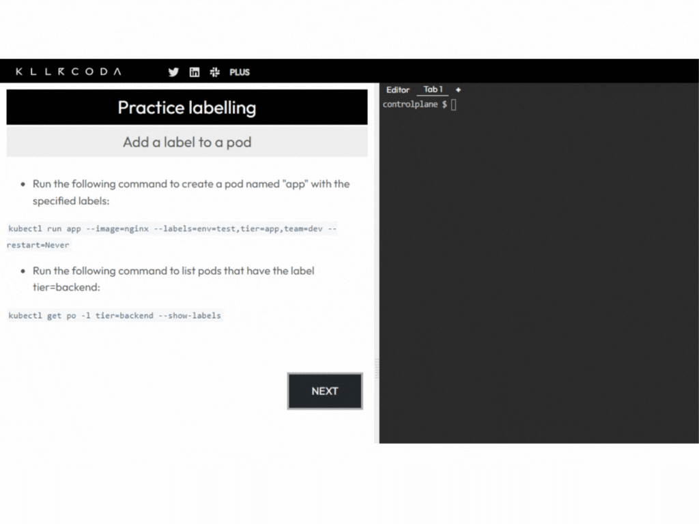

# Kuberada Labs on Github and Killerkoda

Kuberada Labs are now not just on our blog but also on GitHub. Explore hands-on scenarios covering everything from Kubernetes to killer coding challenges. Whether you're a pro or a coding newbie, there's something for everyone. Join our community, share your insights, and let the coding adventures begin!

## GitHub Repository

**Navigate to the github repo here** 👇

<a class="btn btn-success btn-lg" href="https://github.com/colossus06/kuberada-labs" role="button">kuberada labs</a>

## Killerkoda scenarios

**Navigate to killerkoda scenarios here** 👇

<a class="btn btn-success btn-lg" href="https://killercoda.com/kuberada" role="button">kuberada labs</a>

