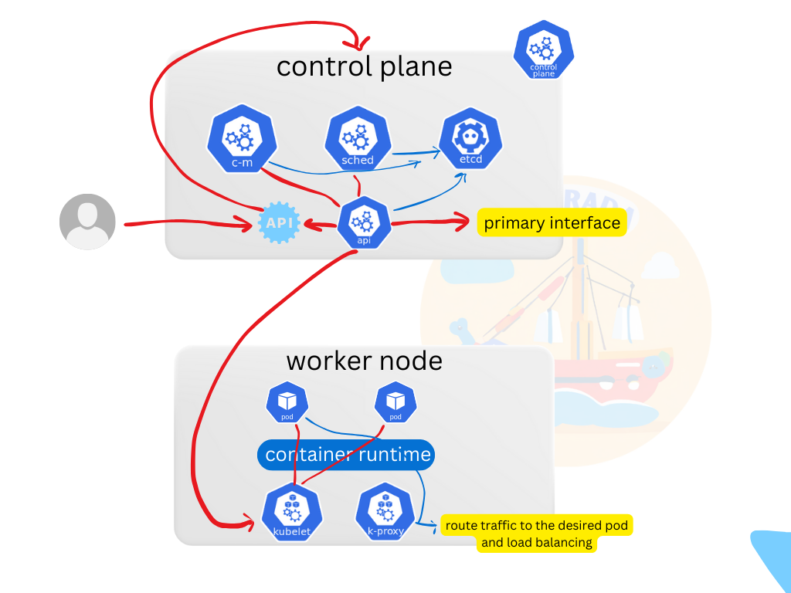
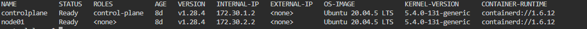
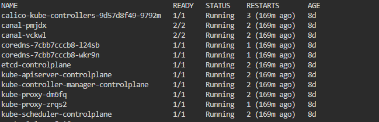
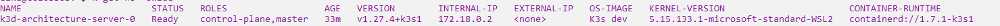
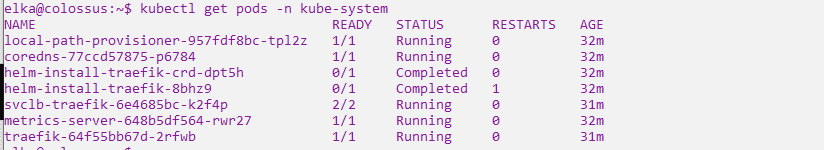

---
myst:
  html_meta:
    "description lang=en": "Understanding Architecture of a Kubernetes Cluster"
    "keywords": "Kubernetes, hands-on, Gulcan Topcu, Devops, kubernetes architecture, control plane components, worker node components"
    "property=og:locale": "en_US"
    "property=og:type" : "article"
    "property=og:title" : "Understanding Architecture of a Kubernetes Cluster"
    "property=og:image": "https://raw.githubusercontent.com/colossus06/kuberada-blog/main/og/kubernetes-architecture.png"
---


(architecture)=
# 🔩 Understanding Architecture of a Kubernetes Cluster⚙️ 

```{article-info}
:avatar: https://raw.githubusercontent.com/colossus06/kuberada-blog/main/og/author.png
:avatar-link: ../../../blogs/authors/gulcan.html
:author: Gulcan Topcu
:date: Jan 14, 2024
:read-time: 5 min read
:class-container: sd-p-2 sd-outline-light sd-rounded-2 sd-shadow-md
```

🏷️**Tagged with:**

```{button-link} ../../../blogs/tag/kubernetes.html
:color: success
:outline:
:shadow:
kubernetes
```

Kubernetes, an open-source container orchestration platform, has transformed the landscape of deploying and managing containerized applications. To harness its power effectively, it's crucial to comprehend the architecture that underpins its scalability and fault-tolerance. Let's navigate through the key components that makes up the Kubernetes architecture.


## Why does it called K8s?

The number "8" in "K8s" represents the eight letters between "K" and "s" in the word "Kubernetes." So we can say that "K8s" is a shorthand way of referring to Kubernetes. 

## Components of Kubernetes Architecture

We have 2 core pieces in a kubernetes cluster: control plane and worker node.




### Master Node/Control Plane

At the heart of Kubernetes architecture lies the master node, acting as the control plane for the entire cluster. It takes charge of managing the cluster state and making pivotal decisions related to scheduling, scaling, and maintaining the desired state of applications.

In production environments, you can observe multiple distributed control plane components to ensure fault tolerance, high availability, and scalability. The number of control plane components is dependent on factors such as the following:

- the size of the Kubernetes cluster, 
- performance requirements, 
- architecture design,
- desired level of redundancy and fault tolerance

You may also observe multiple instances of kube-apiserver to distribute the load and help in redundancy, etcd cluster to prevent a single point of failure, kube-controller-manager and kube-scheduler for high availability.

#### API Server

The API server serves as the central communication hub, exposing the Kubernetes API for seamless interactions with the cluster. It plays a pivotal role in facilitating communication among various components.

#### Scheduler

Tasked with determining the suitable nodes for running specific pod instances, the scheduler factors in resource requirements, constraints, and policies, optimizing the distribution of pods across the cluster.

#### Controller Manager

This component houses controllers (like deployment controller) responsible for preserving the desired state of the cluster. Continuously monitoring the cluster, controllers take corrective actions to ensure alignment with the specified configuration.

#### etcd

etcd, a distributed key-value store, serves as the persistent storage backend for the cluster. It stores configuration data, resource quotas, and access control information, ensuring the integrity of the cluster's data.

### Worker Nodes

The worker nodes form the operational layer, executing application workloads and providing the essential resources for running containers.

#### Kubelet

Kubelet, the primary agent on each worker node, communicates with the master node, ensuring that containers run as expected. It executes instructions received from the master node.

#### Container Runtime

Responsible for container management, the container runtime, such as [Docker](https://www.docker.com/), [containerd](https://containerd.io/), and [CRI-O](https://cri-o.io/), seamlessly integrate with Kubernetes.

#### kube-proxy

Taking charge of network routing and load balancing between containers on different nodes, kube-proxy exposes services to the external world, facilitating smooth inter-container communication.

### Pod

The pod, the smallest operational unit, embodies a single instance of a running process within the cluster. It can house one or more containers that share networking and storage resources, enabling cohesive communication.

### Addons

Kubernetes addons are supplementary components that enhance the capabilities of your cluster. They encompass cluster dns,Container Network Interface (CNI) plugins, observability, loggings, metrics agents, and Kubernetes drivers that facilitate the interaction between the cluster and underlying cloud resources.

### Displaying the components on a live Kubernetes cluster

Essential system components and infrastructure-related pods run in a dedicated namespace called `kube-system`.

To display the he output of the below command provides you a glimpse into these components.

```sh
kubectl get pods -n kube-system
```

We have 2 different clusters . For the first cluster we have [kubeadm](https://kubernetes.io/docs/reference/setup-tools/kubeadm/) v1.28 and for the second one we have installed [k3d](https://k3d.io/v5.6.0/#what-is-k3d).

### kubeadm 2 node cluster components








- The components we see in kubeadm cluster are aligned with a typical Kubernetes cluster. Components like `calico-kube-controllers`, `canal`, `coredns`, `etcd`, `kube-apiserver`, `kube-controller-manager`, `kube-proxy`, and `kube-scheduler` are fundamental parts of a standard Kubernetes control plane.
- This cluster setup is suitable for production-like scenarios with components like `etcd` serving as the distributed key-value store.

### k3d cluster components

Let's take a look at the second cluster. This is a k3d cluster named `architecture`. 






As you can observe, there are differences in the output of `kubectl get pods -n kube-system` command. 

- k3d cluster is a lightweight Kubernetes distribution designed for ease of use and reduced resource requirements. It is suitable for development environments
- The components you see in the output like `local-path-provisioner`, `helm-install-traefik`, `svclb-traefik`, and `traefik`are specific to the K3s distribution used for lightweight and development environments.


## Conclusion

A robust understanding of Kubernetes architecture is important for seamless deployment and management of applications within a cluster. The collaborative orchestration of master nodes, worker nodes, pods, services, and ingress provides a resilient and scalable platform for containerized applications. 

**Enjoyed this read?**

If you found this guide helpful,check our blog archives 📚✨

- Follow me on [LinkedIn](https://www.linkedin.com) to get updated.
- Read incredible Kubernetes Stories: [Medium](https://medium.com/@gulcantopcu)
- Challenging projects: You're already in the right place.

Until next time!


