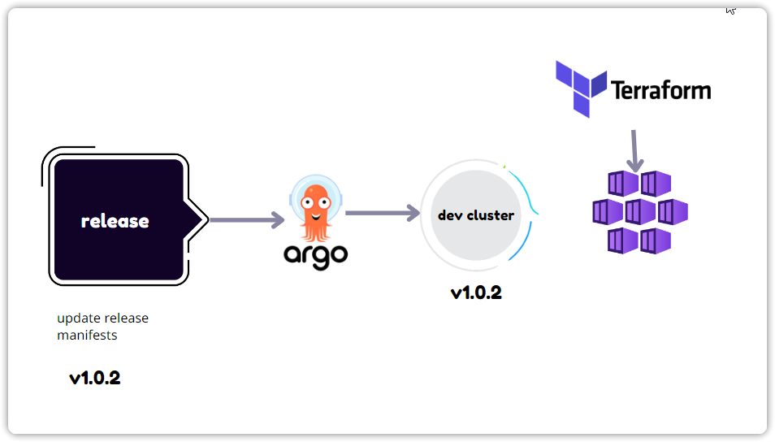
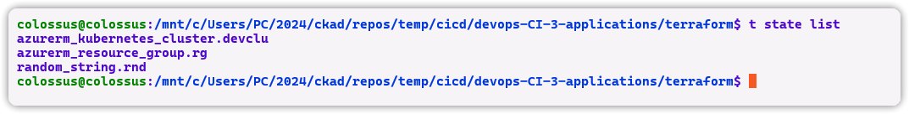
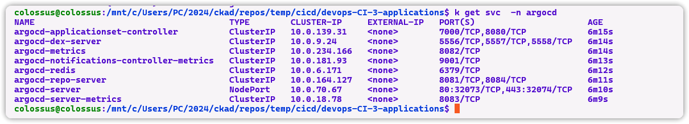
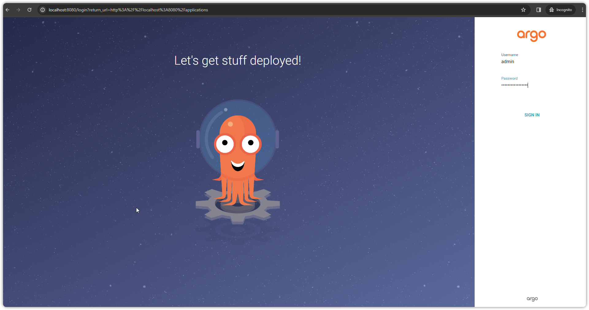
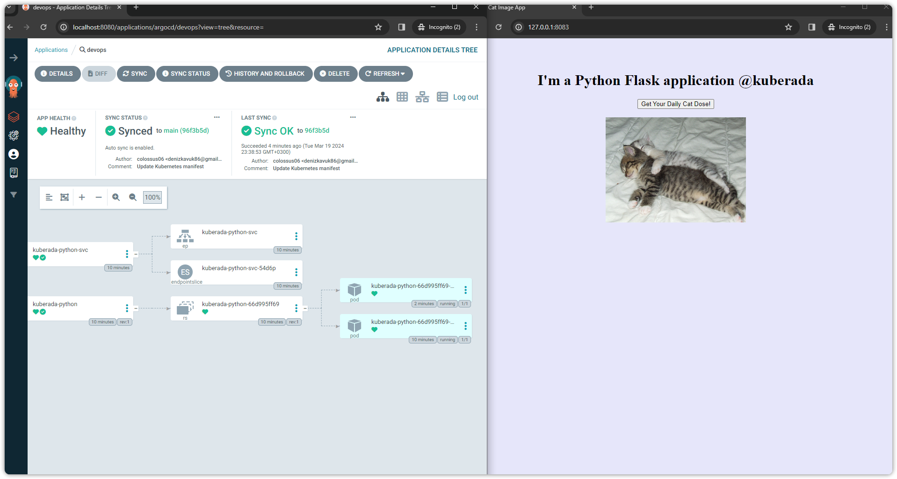
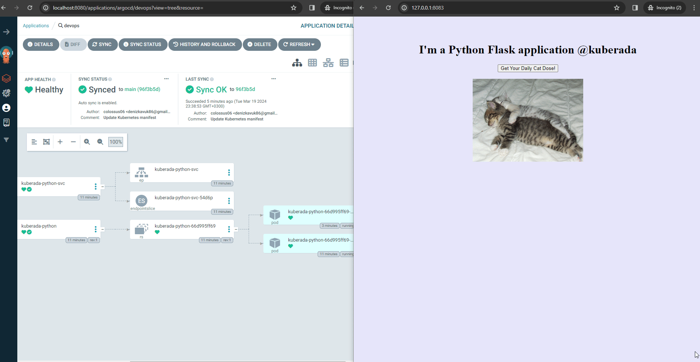
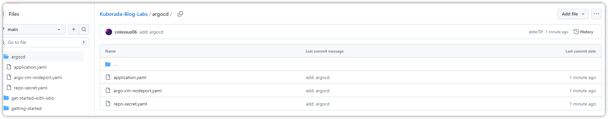

---
myst:
  html_meta:
    "description lang=en": "Learn how to quickly set up and connect ArgoCD with Azure Kubernetes Service (AKS) in just 5 minutes. This hands-on guide walks you through the process of deploying ArgoCD on your AKS cluster, configuring it to monitor changes in your Git repository, and setting up a simple nginx deployment for demonstration. Follow the step-by-step instructions and start deploying your applications with ease using GitOps principles."
    "keywords": "ArgoCD, AKS, Azure Kubernetes Service, GitOps, Deployment, Kubernetes, Azure, ArgoCD setup, ArgoCD installation, GitOps principles, AKS cluster, Azure CLI, kubectl, Terraform, Kubernetes concepts, ArgoCD UI, Hands-on guide"
    "property=og:locale": "en_US"
    "property=og:type" : "article"
    "property=og:title" : "How to Setup and Connect ArgoCD with AKS in 5 mins"
    "property=og:image": "https://raw.githubusercontent.com/colossus06/kuberada-blog/main/og/argo.png"
---


(argo)=
# How to Setup and Connect ArgoCD with AKS in 5 mins

```{article-info}
:avatar: https://raw.githubusercontent.com/colossus06/kuberada-blog/main/og/author.png
:avatar-link: ../../../blogs/authors/gulcan.html
:author: Gulcan Topcu
:date: March 19, 2024
:read-time: 5 min read
:class-container: sd-p-2 sd-outline-light sd-rounded-2 sd-shadow-md
```

🏷️**Tagged with:**

```{button-link} ../../../blogs/tag/kubernetes.html
:color: success
:outline:
:shadow:
kubernetes
```

ArgoCD is a powerful tool that utilizes GitOps principles to automate and streamline your Kubernetes application deployments. It continuously monitors your Git repository, acting as the single source of truth for your desired application state. When it detects a change, ArgoCD controller automatically reconciles the running applications with the configurations in your Git repository, ensuring a consistent and version-controlled deployment process. 

In this guide, I'll walk you through setting up ArgoCD on your AKS cluster to manage deployments of Python applications stored in a private registry. While the demo uses a python flask deployment and service file for illustrative purposes (ingress, external DNS and cert manager is on the way!), you can easily substitute it with the NGINX application manifests on our repo. The deployment YAML for NGINX is provided in kuberada labs repo for reference, you can find the nginx manifest files there. 

- All the codes used:

```{button-link} https://gist.github.com/colossus06/19da49118fcb3fc6f28b093a76f3953a
:color: success
ArgoCD Gist 
```
- Manifest and terraform files:

```{button-link} https://github.com/colossus06/Kuberada-Blog-Labs/tree/main/argocd
:color: success
Files 
```

Let's dive in!



**Prerequisites:**

- An existing Azure subscription with AKS cluster creation permissions
- Azure CLI installed and configured with your subscription
- kubectl configured to access your AKS cluster
- Basic understanding of Kubernetes concepts

**Creating the AKS Cluster:**

If you don't have an AKS cluster, you can create one using the Azure CLI or terraform. Refer to [Microsoft's documentation](assets/https://learn.microsoft.com/en-us/azure/aks/) for detailed instructions.

While this guide focuses on deploying ArgoCD on an existing AKS cluster, you can spin up a minikube, k3d cluster too. If you don't have one, you can easily create one using the Azure CLI or the terraform code we store on https://github.com/colossus06/Kuberada-Blog-Labs/tree/main/argocd.



## Installing ArgoCD on AKS

### Download the ArgoCD Manifest


Start by downloading the ArgoCD manifest file from the [ArgoCD repository](assets/https://github.com/argoproj/argo-cd/blob/master/manifests/install.yaml).

  ```sh
  wget https://raw.githubusercontent.com/argoproj/argo-cd/stable/manifests/install.yaml
  ```

### Configure ArgoCD

Rename the `install.yaml` file to `argo-cm-nodeport.yaml` and configure ArgoCD for your environment:

- Disable TLS and configure insecure connection:

  ```sh
  data:
    server.insecure: "true"
  ```

- Change the `argocd-server` service type to NodePort:

  ```sh
  spec:
    type: NodePort
  ```

### Connect SCM and ArgoCD

Since we are using a private repo, we need to create a secret to authenticate with your private Git repository. If you're using the sample nginx manifest file, you can safely skip this step.


### Deploy ArgoCD

Apply the modified `argo-cm-nodeport.yaml` file and the secret to deploy ArgoCD:




### Access the ArgoCD UI

Open the ArgoCD UI using port forwarding:

```sh
kubectl port-forward svc/argocd-server -n argocd 8080:443
```

Access the UI at `http://localhost:8080` and log in with the default username admin and password you get with following the gist.



## Validation

As you can see, repo and application is already setup and the status is healthy. We didn't interact with the cluster directly instead delegated out github repo as the single source of truth.



## Conclusion

Congratulations! 

You've successfully set up ArgoCD on your AKS cluster. Now you can deploy your applications with ease using GitOps principles.



- See all the code used in this demo in this gist [here](https://gist.github.com/colossus06/19da49118fcb3fc6f28b093a76f3953a).

- Access the manifests on our kuberada repo [here](https://github.com/colossus06/Kuberada-Blog-Labs/tree/main/argocd)



## Find all the resources used in this blog here: 

- All the codes used:

```{button-link} https://gist.github.com/colossus06/19da49118fcb3fc6f28b093a76f3953a
:color: success
ArgoCD Gist 
```
- Manifest and terraform files:

```{button-link} https://github.com/colossus06/Kuberada-Blog-Labs/tree/main/argocd
:color: success
Files 
```

## References


- [ArgoCD Documentation](assets/https://argoproj.github.io/argo-cd/)
- [Azure Kubernetes Service (AKS) Documentation](assets/https://docs.microsoft.com/en-us/azure/aks/)
- [GitOps Principles](assets/https://www.gitops.tech/)


**Enjoyed this read?**

If you found this guide helpful,check our blog archives 📚✨

- Follow me on [LinkedIn](https://www.linkedin.com/in/gulcantopcu/) to get updated.
- Read incredible Kubernetes Stories: [Medium](https://medium.com/@gulcantopcu)
- Challenging projects: You're already in the right place.

Until next time!

<script src="https://utteranc.es/client.js"
        repo="colossus06/Kuberada-Blog"
        issue-term="pathname"
        label="blog"
        theme="github-light"
        crossorigin="anonymous"
        async>
</script>