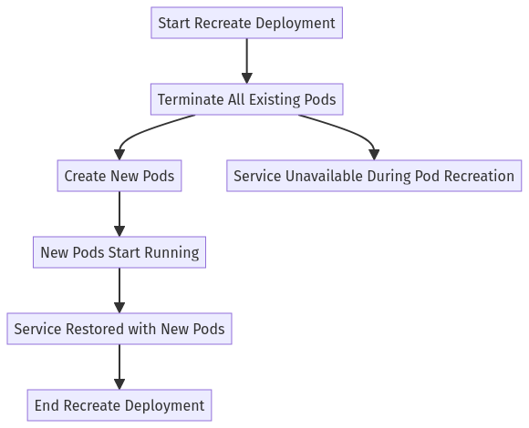

---
myst:
  html_meta:
    "description lang=en": "Learn how to achieve zero-downtime deployments with Kubernetes using advanced strategies like Blue/Green and Canary deployments. This comprehensive guide dives deep into Kubernetes deployment techniques, offering real-world examples, code snippets, and practical tips to keep your applications running smoothly during updates. Perfect for DevOps professionals aiming to master seamless, uninterrupted deployments."
    "keywords": "Kubernetes zero-downtime deployments, Blue/Green deployments Kubernetes, Canary deployments Kubernetes, Kubernetes deployment strategies, seamless Kubernetes deployments, Kubernetes DevOps, Kubernetes deployment best practices, Kubernetes deployment guide, zero-downtime Kubernetes, advanced Kubernetes techniques, rolling updates Kubernetes, Kubernetes deployment automation, Kubernetes GitOps, Kubernetes CI/CD, Kubernetes monitoring tools, Kubernetes security"
    "property=og:locale": "en_US"
    "property=og:image": "https://raw.githubusercontent.com/colossus06/kuberada-blog/main/og/workloads.png"
---


 
(deploy)=
# Kubernetes: The Art of Zero-Downtime Deployments

```{article-info}
:avatar: https://raw.githubusercontent.com/colossus06/kuberada-blog/main/og/author.png
:avatar-link: ../../../blogs/authors/gulcan.html
:author: Gulcan Topcu
:date: Aug 5, 2024
:read-time: 25 min read
:class-container: sd-p-2 sd-outline-light sd-rounded-2 sd-shadow-md
```

🏷️**Tagged with:**

```{button-link} ../../../blogs/tag/kubernetes.html
:color: success
:outline:
:shadow:
kubernetes
```

Downtime is a nightmare for businesses, costing money and eroding customer trust. With its powerful container orchestration capabilities, Kubernetes offers a solution: seamless deployments that keep your application running smoothly even during updates. However, achieving this zero-downtime magic requires a strategic approach and an understanding of advanced techniques.

This blog post will guide you through the techniques you need to achieve seamless deployments in Kubernetes. We'll also put these strategies into practice using a knowledge-powered customer support chatbot. 

We'll explore various deployment strategies, such as Blue/Green and Canary, sharing real-world examples and key metrics to monitor along the way. 

When you finish reading, you'll have the confidence and knowledge to upgrade your applications seamlessly. Let's make downtime a thing of the past!


## Kubernetes Built-in Deployment Strategies: Smooth Sailing with Rolling Updates

Kubernetes Deployments offer a powerful, declarative way to manage your applications. Simply specify how many instances (replicas) of your app should be running and the container image to use. Kubernetes handles the rest, automatically creating and managing a ReplicaSet to keep things running smoothly even if nodes fail or other disruptions occur. 

### Matching Labels: The Key to Pod Management

A key aspect of Deployments is pinpointing which Pods to manage. This is achieved using labels.  

The `spec.selector.matchLabels` field in your Deployment acts like a filter, specifying which labels Kubernetes should look for to identify the Pods it's responsible for. These labels must match the ones you've attached to your Pods in the `spec.template.metadata.labels` section. 

It's like tagging your Pods and then telling your Deployment to only manage Pods with specific tags. It's critical that the labels in `spec.selector.matchLabels` and `spec.template.metadata` match exactly.

### Rolling Deployments


Kubernetes comes with two built-in deployment strategies; the default is `RollingUpdate .`This strategy is ideal for updating your application with minimal user disruption. It gradually replaces old Pods with new ones, ensuring your application remains available throughout the update process.

Imagine you're running a customer support chatbot named "Kuberada Chatbot" that utilizes a knowledge base. You want to upgrade this chatbot to version 2.0, which includes essential feature enhancements and bug fixes, without causing any downtime for your users. Let's see how a Rolling Deployment makes this possible.


Our current YAML file defines a Deployment named `chatbot` that manages two replicas of the `kuberada-chatbot` container, currently running version 1.0 of the image:

```yaml
apiVersion: apps/v1
kind: Deployment
metadata:
  name: chatbot
spec:
  replicas: 2 
  selector:
    matchLabels:
      app: chatbot
  template:
    metadata:
      labels:
        app: chatbot
    spec:
      containers:
      - name: kuberada-chatbot
        image: kuberada-chatbot:v1.0
        ports:
      - containerPort: 5000
```

The Deployment controller automatically adds a `pod-template-hash` label to each ReplicaSet it creates. This ensures that child ReplicaSets don't overlap, as seen in the following output:

```yaml
kubectl get pods --show-labels
NAME                                   READY   STATUS    RESTARTS   AGE     LABELS
chatbot-748fd587d8-hrjmp   1/1     Running   0          2m23s   app=chatbot,pod-template-hash=748fd587d8
chatbot-748fd587d8-xdmpt   1/1     Running   0          4m26s   app=chatbot,pod-template-hash=748fd587d8
``` 
### Maintaining service availability while upgrading to version 2.0

Now, let's upgrade our chatbot to version 2.0, which includes essential feature enhancements and bug fixes. We want to do this with minimal disruption, ensuring that at least one instance of the chatbot is always available to handle user requests. We'll achieve this by fine-tuning the rolling update strategy and `maxUnavailable` and `maxSurge` parameters. 

The impact of these parameters becomes more significant in our small-scale deployment. Since we have two replicas and decided to allow one Pod to be unavailable during the update, half of our capacity could be down anytime.

Similarly, setting `maxSurge: 1` permits one additional Pod to be created above the desired replica count, temporarily increasing the total number of Pods to three during the update.

```yaml
...
  strategy:
    type: RollingUpdate # Explicitly set to RollingUpdate (default)
    rollingUpdate:
      maxUnavailable: 1
      maxSurge: 1        # Allow one extra pod during the update
  template:
    metadata:
      labels:
        app: chatbot
    spec:
      containers:
 - name: kuberada-chatbot
        image: kuberada-chatbot:2.0 # Updated image tag
...
```

To update the image, we'll use:

```bash
k set image deploy chatbot kuberada-chatbot=kuberada-chatbot:v2.0 
k get rs,deploy
```

Kubernetes then orchestrates the rolling update. You can monitor its progress with:

```bash
k rollout status deploy chatbot
```


This command provides real-time updates, showing how many pods are updating, how many are available, and if any errors have occurred.


**Handling Rollout Issues**

But what if the rollout gets stuck? What if the new pod fails to start due to issues like image pull errors, application misconfigurations, resource constraints, or bugs in the latest version?

If a rollout encounters problems, the Deployment controller automatically intervenes and halts it, preventing the new ReplicaSet from scaling up further. This safeguard prevents a faulty deployment from taking down your entire service. The existing pods continue to handle the load, ensuring continuous service availability.

If you enable rollback mechanisms (by setting `revisionHistoryLimit` to a non-zero value), Kubernetes can automatically revert to the previous stable state if the deployment fails. 

**Rollback to Stability and revisionHistoryLimit**

Kubernetes maintains a history of your changes to a Deployment, recording each change as a separate revision through `spec.revisionHistoryLimit`. This parameter provides a valuable audit trail and allows for easy rollbacks to previous versions if necessary.

Let's say we want to roll back to the last stable version. We can use the following command:

```yaml
k rollout undo deploy chatbot
```


This ensures that at least one pod (the old version) remains operational, providing uninterrupted service while we address the issues in the new version.


By setting `maxUnavailable` to 1 and having two replicas, we balance high availability and efficient updates. Even in the face of potential deployment issues, Kubernetes' built-in safeguards and rollback mechanisms ensure minimal disruption to your service. 

We can further enhance our deployment by configuring a readiness probe for our chatbot service container. This allows Kubernetes to accurately assess the health of each pod and ensure that client traffic is directed only to those that are fully operational and ready to handle requests.


## Fixed Deployments (Recreate)



Let's consider a scenario in which our data engineers plan to update our AI model, incorporating more extensive data sources to enhance response quality and accuracy. Before deploying these changes to production, we must thoroughly test them in a development environment. 

Due to the significant nature of these updates, we'll utilize the fixed deployment (Recreate) strategy in the dev environment to ensure consistency throughout the transition. This strategy will terminate all existing Pods before creating new ones with the updated configuration. 

While this approach is more straightforward, it results in downtime. However, it's well-suited for non-production environments or scenarios where a brief service interruption is acceptable.

**Deployment Configuration**

Here's a Deployment configuration example using the Recreate strategy:

```yaml
spec:
  replicas: 2
  strategy:
    type: Recreate
  selector:
    matchLabels:
      app: chatbot-dev
```

This configuration ensures that all existing pods are terminated before new ones, incorporating the latest updates, are created.


**Production Rollout**

Once testing in the development environment is successful, we can schedule the production rollout during off-peak hours, such as late at night or early in the morning, to minimize any impact on users. 

**Choosing the Right Strategy**

The ideal deployment strategy depends on your specific needs. Rolling deployments are generally preferred for production environments where minimizing downtime is critical. Fixed deployments, on the other hand, are more swift, effective, and suitable for development or testing environments or when brief downtime is acceptable. 

### Limitations of Basic Deployments and the Need for Advanced Strategies

While rolling updates in Kubernetes offer some control, they don't inherently guarantee zero downtime. Even the briefest service interruption can be detrimental for applications with strict uptime requirements or intricate dependencies. We've seen that Kubernetes provides some control through `maxSurge` and `maxUnavailable` settings, but these alone might not eliminate downtime. 

Furthermore, with proper configuration of session affinity (ensuring a user's requests are directed to the same pod throughout their session), users might experience smooth transitions between the old and new versions of the application during an update. This can lead to a poor user experience or errors, primarily if the two versions handle data or behave differently. 

We must go beyond Kubernetes' built-in capabilities and implement specific techniques to achieve near-zero downtime deployments. Let's explore one such technique: graceful shutdown and readiness probes. 

**Implementing Graceful Shutdown**

A graceful shutdown lets your application finish processing ongoing requests before the pod terminates. This is essential for preventing "connection reset by peer" errors, which can occur during a rolling update when the load balancer sends requests to shutting down pods.

During rolling updates, Kubernetes replaces old pods with new ones. By ensuring the old pods gracefully shut down, we reduce the chances of dropping or mishandling requests mid-transition.

When a pod receives a termination signal, Kubernetes removes it from the service's list of endpoints. The `preStop` hook gives Kubernetes time to update its internal state and prevent new connections from being routed to the terminating pod. A brief sleep in the `preStop` hook further ensures that in-flight requests can be completed and no new requests are sent to the pod, further minimizing the risk of connection reset errors.

We have integrated the shutdown process directly into our application code for a clean and efficient solution. 

```python
def handle_shutdown_signal(signum, frame):
    print("Graceful shutdown initiated.")
 time.sleep(10) #or 
 sys.exit(0)

signal.signal(signal.SIGTERM, handle_shutdown_signal)
signal.signal(signal.SIGINT, handle_shutdown_signal) 
```

However, if you prefer to let Kubernetes handle the shutdown delay, you can use a `preStop` hook to introduce a brief pause (e.g., 10 seconds) before the container terminates:

```yaml
lifecycle:
  preStop:
    exec:
      command: ["/bin/sh", "-c", "sleep 10"]
```

Remember, even with services like NodePort, a short `preStop` delay is beneficial because it allows Kubernetes to update networking rules and stop sending traffic to the pod before it's terminated.

Here is a go-to article if you want to dive deep into [graceful shutdowns for long-running tasks](https://learnk8s.io/graceful-shutdown).

**Readiness Probes: Ensuring Pod Readiness**

Let's configure the readiness probe to ensure that Kubernetes only directs traffic to fully initialized pods and is ready to handle requests. This proactive measure further enhances the stability and reliability of our deployments.

```yaml
#spec.template.spec.containers
readinessProbe:
  httpGet:
    path: /health
    port: 5000
  initialDelaySeconds: 250  # Wait 2 minutes before starting readiness checks
  periodSeconds: 20  # Check every 20 seconds
  timeoutSeconds: 10  # Allow up to 10 seconds for the response
  failureThreshold: 3  # Mark the pod as unready after 3 consecutive failures
```
```python
#app.py
...
@app.route('/health')
def health_check():
    # Basic check to see if the application has loaded the necessary components
    if embeddings is not None and model is not None:
        return "Healthy", 200
    else:
        return "Unhealthy", 500
...
```

**What We Have Achieved with readinessProbe**

With the addition of the readinessProbe and the corresponding `/health` endpoint in our Python code, we've now established a mechanism for Kubernetes to intelligently determine when a pod is genuinely ready to receive traffic. 

Now, Kubernetes will only send requests to pods that have successfully passed their readiness checks, ensuring that users are never directed to a pod that is still in the process of starting up or experiencing issues. 

The readinessProbe will act as an additional safeguard during rolling updates. Kubernetes will terminate an old pod when a new pod with the updated version has passed its readiness checks and is fully prepared to handle traffic. 

**Preventing incomplete initialization: initialDelaySeconds**

The `initialDelaySeconds` parameter, set to approximately 4 minutes, is crucial for our knowledge-based chatbot because it requires a significant amount of time to load its underlying knowledge base and language models into memory upon startup. Setting a longer initial delay allows the chatbot to complete this initialization process before Kubernetes checks its readiness and potentially sends traffic. 

**The Need for Advanced Strategies**

While these techniques help minimize downtime, we must explore advanced deployment strategies like Blue/Green and Canary deployments for mission-critical applications where even the slightest disruption is unacceptable. These strategies offer more fine-grained control and flexibility, ensuring your applications remain consistently available and reliable, even during updates.

#### The Need for Advanced Strategies

While Kubernetes' built-in deployment strategies offer a good starting point, they may only sometimes be sufficient for applications where even the slightest downtime can significantly impact them. For many organizations, the cost of downtime is too high. Lost revenue, damaged reputation, and potential compliance violations can all result from even brief service interruptions. This is where advanced deployment strategies, such as Blue/Green and Canary deployments, come in. These strategies offer more fine-grained control and flexibility, ensuring your applications remain consistently available and reliable, even during updates.

### Deep Dive into Zero-Downtime Deployment Strategies

#### Blue/Green Deployments ( A/B deployments)


Blue/Green deployments offer a seamless way to update your application without any downtime. Think of it as having two identical production environments, one labeled "Blue" (your current live version) and the other "Green" (where you deploy the new version). Once you've thoroughly tested and validated the latest version in the Green environment, you switch all the traffic from Blue to Green, making Green the new live production environment.

Let's walk through how to set up a Blue/Green deployment for our chatbot application in Kubernetes. 

Create two deployment files for the current environment (blue) and green. 

```yaml
apiVersion: apps/v1
kind: Deployment
metadata:
  name: chatbot-blue
spec:
  replicas: 2
  selector:
    matchLabels:
      app: chatbot
      version: blue
  template:
    metadata:
      labels:
        app: chatbot
        version: blue
    spec:
      containers:
 - name: chatbot
        image: kuberada-chatbot:blue
        ports:
 - containerPort: 5000
```

The Green environment will host the new version of the chatbot.

```yaml
apiVersion: apps/v1
kind: Deployment
metadata:
  name: chatbot-green
spec:
  replicas: 2
  selector:
    matchLabels:
      app: chatbot
      version: green
  template:
    metadata:
      labels:
        app: chatbot
        version: green
    spec:
      containers:
      - name: chatbot
              image: kuberada-chatbot:green
              ports:
      - containerPort: 5000
```

We have two deployments running and one Service (blue deployment svc), which routes traffic to the Blue environment. 


```yaml
gulcan@topcu:~$ k get po,rs,deploy,svc
NAME                                 READY   STATUS    RESTARTS   AGE
pod/chatbot-blue-6bd7dfb695-4zjv2    1/1     Running   0          13m
pod/chatbot-blue-6bd7dfb695-hcf96    1/1     Running   0          13m
pod/chatbot-green-797c56675c-dqdgj   1/1     Running   0          4m45s
pod/chatbot-green-797c56675c-pc9wx   1/1     Running   0          4m45s

NAME                                       DESIRED   CURRENT   READY   AGE
replicaset.apps/chatbot-blue-6bd7dfb695    2         2         2       13m
replicaset.apps/chatbot-green-797c56675c   2         2         2       4m45s

NAME                            READY   UP-TO-DATE   AVAILABLE   AGE
deployment.apps/chatbot-blue    2/2     2            2           13m
deployment.apps/chatbot-green   2/2     2            2           4m45s

NAME                 TYPE        CLUSTER-IP    EXTERNAL-IP   PORT(S)        AGE
service/chatbot      NodePort    10.96.126.2   <none>        80:30007/TCP   13m
```

**Switching to the Green**


After validating the blue environment (version blue of the chatbot), update the Service to point to the Green environment, label of the green deployment:

```yaml
apiVersion: v1
kind: Service
metadata:
  name: chatbot-service
spec:
  selector:
    app: chatbot
    version: green
...

...
#k describe svc chatbot
gulcan@topcu:~$ k describe svc chatbot 
Name: chatbot
Namespace: default
Labels: <none>
Annotations: <none>
Selector: app=chatbot,version=green
Type: NodePort
...
```

After successfully switching traffic to the Green environment, you may decommission the Blue environment to free up resources.


**Key Takeaways**

Blue/Green deployments provide a reliable strategy for zero-downtime implementations, particularly for large-scale applications where downtime is not an option. The ability to quickly switch back to the previous version (Blue) if any issues arise makes it a highly resilient approach by simply updating the service routing to point back to the Blue environment.

This deployment approach is especially valuable for mission-critical applications like our chatbot and industries such as finance, healthcare, and e-commerce, where maintaining uninterrupted service is paramount.

While Blue/Green deployments are powerful, they come with some potential challenges:

* When you have database changes, it's important to handle them carefully to avoid disrupting your live production environment. Techniques like dual writes or schema versioning can help you achieve this. Tools like Flyway or Liquibase (Java-based) can manage database migrations effectively in such scenarios.
* You'll want to make sure user sessions are maintained smoothly across both environments. This can be achieved by using external session stores like Redis (typically used with Python, Node.js, Java) to store session data centrally, allowing sessions to persist even when traffic is switched between environments.
* Before switching traffic, thoroughly test your new version in the Green environment. Automated testing tools like Selenium (Java, Python, C#) and Cypress (JavaScript) for functional testing and Apache JMeter (Java) or k6 (JavaScript) for load testing are your allies in validating your new deployment. You can also use Locust to test Python-based applications.

## Canary Deployments


Canary deployments involve gradually rolling out a new version of your application to a small subset of users while most continue using the stable version. This approach allows you to monitor the latest release in a real-world production environment and ensure it functions as expected before gradually increasing traffic.

Suppose our team has developed a new, improved AI model for our chatbot. To test its performance in real-world conditions before a full rollout, we'll deploy it using a canary strategy, gradually exposing the new model to a subset of our users.

We'll begin with deploying our stable version with three replicas.

```yaml
apiVersion: apps/v1
kind: Deployment
metadata:
  name: chatbot-stable
spec:
  replicas: 3
  selector:
    matchLabels:
      app: chatbot
  template:
    metadata:
      labels:
        app: chatbot
    spec:
      containers:
      - name: kuberada-chatbot
        image: kuberada-chatbot:stable
...
---
apiVersion: v1
kind: Service
metadata:
  name: chatbot
spec:
  selector:
    app: chatbot
  ports:
 - protocol: TCP
      port: 5000
      targetPort: 5000
```


Next, we'll create a new deployment for the canary version, using a smaller number of replicas (e.g., 1) and the new image `kuberada-chatbot:canary`.

```yaml
apiVersion: apps/v1
kind: Deployment
metadata:
  name: chatbot-canary
spec:
  replicas: 1
  selector:
    matchLabels:
      app: chatbot
  template:
    metadata:
      labels:
        app: chatbot
    spec:
      containers:
      - name: kuberada-chatbot
        image: kuberada-chatbot:canary
```


What about the traffic splitting?

Both deployments now share the same `app: chatbot` label, allowing the service to target pods from both versions. Kubernetes will distribute incoming traffic to the `chatbot` service between the pods in both deployments proportionally to their replica counts. 

**Testing the traffic Splitting**

We can test which Pods are receiving traffic using `curl`:


With 3 replicas for the stable version and 1 for the canary, roughly 75% of traffic will go to the stable version and 25% to the canary.

### Monitoring and Gradual Rollout

To ensure a smooth canary deployment, you'll want to actively monitor your stable and canary deployments using tools like Prometheus and Grafana. This lets you make informed decisions about the rollout and quickly respond to potential issues.

We've configured our application to expose metrics such as request latency and request count, and we've annotated both versions of the chatbot deployment to tell Prometheus where to scrape these metrics from. 

**Key Metrics to Watch**

Let's focus on monitoring these crucial indicators:

* **Increase in HTTP 5xx errors:**

```promql
rate(http_requests_total{status=~"5.."}[5m])
```

* **Overall response times:**

```promql
histogram_quantile(0.95, sum(rate(request_latency_seconds_bucket[5m])) by (le))
```

* **Chatbot-specific response time:**

```promql
histogram_quantile(0.95, sum(rate(chatbot_response_time_seconds_bucket{app="chatbot", version="canary"}[5m])) by (le))
```

* **System load:**

```promql
rate(request_count_total[5m])
```


Grafana offers a powerful way to visualize these metrics collected by Prometheus. Consider setting up separate dashboards for the canary and stable versions to compare their performance easily.


**Making the Call: Full Rollout or Not?**

Before you fully roll out the canary version, carefully evaluate these key indicators:

1.  **Error Rate:** Is the canary's error rate at or below the stable version's? Any spikes are a major red flag.

2.  **Latency:** Is the canary version maintaining or improving response times compared to the stable version? Significant increases in latency could indicate underlying problems.

3.  **Resource Usage:** Is the canary version using more CPU or memory than the stable version? Monitor this to avoid resource bottlenecks.

4.  **User Feedback:** If possible, gather qualitative data, such as user feedback or support tickets, to complement your metrics.

5.  **Steady-State Performance:** Allow the canary version to run significantly under real-world conditions. This will help you catch any delayed or intermittent issues that might not appear immediately.

**Key Decisions Before Rollout**

*   **Thresholds:** Define clear thresholds for error rates, latency, and resource usage that the canary must meet before you fully roll it out.

*   **Stability Over Time:** Before increasing traffic to the canary version, make sure it maintains consistent performance over a set period.

*   **Risk Assessment:** Consider the potential impact of a full rollout. If the canary introduces significant new functionality or changes, be more cautious in your assessment.

*   **Automated Rollback:** Have automated rollback procedures in place just in case the canary version doesn't meet your performance expectations during the rollout.

With these checks in place, you can confidently roll out your canary version, knowing it will likely meet your performance and stability goals.

**Gradual Rollout and Rollback with Kubernetes**

Once you're confident in the canary, gradually increase its traffic share by scaling up its replica count while scaling down the stable version. If any problems arise during this gradual rollout, Kubernetes makes it easy to roll back to the stable version by simply adjusting the replica counts.


**Argo Rollouts**

Argo Rollouts is a Kubernetes controller that enables advanced deployment strategies like canary and blue-green deployments. It also offers features like automated rollbacks and metric-based analysis, making it a powerful tool for complex implementations.

For our knowledge-powered chatbot, we let's use Argo Rollouts to implement a canary deployment strategy. 

Instead of using a standard Deployment, you define a Rollout resource, which allows for controlled traffic shifting to the new version based on predefined steps. This approach allows you to monitor the canary release closely and roll back if necessary.

```yaml
apiVersion: argoproj.io/v1alpha1
kind: Rollout
metadata:
  name: chatbot-canary
spec:
  replicas: 2
  strategy:
    canary:
      steps:
        - setWeight: 10
        - pause: {duration: 5m}
        - setWeight: 50
        - pause: {duration: 10m}
        - setWeight: 100
  selector:
    matchLabels:
      app: chatbot
  template:
    metadata:
      labels:
        app: chatbot
        version: canary
    spec:
      containers:
      - name: kuberada-chatbot
        image: kuberada-chatbot:canary
        ports:
        - containerPort: 5000
```

Now Argo Rollouts will gradually shift traffic to the canary version, providing a controlled environment for monitoring and quick rollback if necessary. This process can minimize downtime and ensure that the new version is stable before a full rollout.

### Beyond Basic Canary: Advanced Techniques

While we've explored manual traffic splitting and progressive delivery with Argo Rollouts, the world of canary deployments offers even more advanced techniques. For instance, Istio, a service mesh, provides fine-grained control over traffic routing and precise percentage-based traffic splitting between application versions. On the other hand, Flagger, a Kubernetes operator, automates the entire canary process, handling traffic shifting and metric analysis to determine if the canary is healthy enough for a full rollout. If you want even more granular control, feature flags allow you to selectively activate specific features for a subset of users. Tools like LaunchDarkly or Split can help you manage this.

### The Power of Canary Deployments

Canary deployments are a powerful tool in your DevOps arsenal. They offer a safe and controlled way to introduce new versions of your application, significantly minimizing the risk of widespread issues. By carefully monitoring and analyzing key metrics during the canary phase, you can make informed decisions about the rollout and quickly revert if necessary.  Remember, the best canary deployment technique will depend on the specific needs of your application and infrastructure. For more complex scenarios, tools like Istio, Flagger, and Argo Rollouts offer additional automation and control. 


### Comparing Blue-Green and Canary Deployments

Let's take a closer look at how Blue/Green and Canary deployments stack up against each other.


**Blue-Green Deployments**

* **Parallel Environments:** In a Blue/Green deployment, both the old (blue) and new (green) versions of your application run side-by-side, each with its own set of replicas. 
* **Traffic Switch:** Initially, all traffic is directed to the blue environment. Once the green environment is thoroughly tested and ready, you simply flip a switch and route all traffic to the green environment.
* **Quick Rollback:** If any issues arise with the new version, you can instantly switch traffic back to the blue environment, minimizing user impact.
* **Resource Intensive:** The downside is that Blue/Green deployments require more resources since you're essentially running two complete environments simultaneously. 
* **Ideal Use Cases:** Blue/Green deployments are well-suited for major updates where even a brief period of downtime is unacceptable.

**Canary Deployments**

* **Gradual Rollout:** With Canary deployments, you introduce the new version to a small subset of users while the majority continue using the stable version. Traffic is gradually shifted from the stable to the canary version based on predefined success criteria.
* **Controlled Rollback:**  If any issues arise, you can easily halt the canary deployment and redirect all traffic back to the stable version.
* **Resource Efficient:** Canary deployments are generally more resource-efficient than Blue/Green deployments since you're only running a limited number of replicas for the new version.
* **Ideal Use Cases:** Canary deployments are perfect for A/B testing, gradually rolling out new features, and gathering real-world user feedback without impacting the majority of your users.

**Choosing the Right Strategy**

The ideal deployment strategy will depend on your specific application, its requirements, and your risk tolerance. Blue/Green deployments offer a straightforward rollback path and ensure zero downtime, but they come with a higher resource cost. Canary deployments are more resource-efficient and offer greater control over the rollout process, but they might introduce a small risk of exposing some users to potential issues with the new version.

### Other Strategies and Tools for Zero-Downtime Deployments

Beyond Blue/Green and Canary deployments, several other techniques and tools can help you achieve seamless Kubernetes deployments with minimal or zero downtime. Here’s a breakdown of these advanced strategies:

**A/B Testing**

A/B testing involves deploying two or more versions of an application or feature simultaneously to different user segments. This allows you to compare user behavior and outcomes between the versions, helping you determine which one performs better in terms of engagement or conversion rates. While not traditionally focused on zero downtime, A/B testing can be used alongside other deployment strategies to ensure that only the best-performing version reaches all users. It’s more about feature effectiveness and user experience rather than purely about risk mitigation.

**Shadow Deployments**

Shadow deployments allow you to run a new version of your application alongside the current version, without exposing it to users. The new version processes the same traffic as the live version, but its responses are discarded. This is ideal for testing performance, load handling, and identifying potential issues in a production-like environment without affecting the user experience. Shadow deployments are especially useful in scenarios where you need to validate application behavior under real load before a full rollout, helping you achieve a smoother transition with minimal risk.


**Progressive Delivery with Feature Flags**

Progressive delivery allows teams to release features gradually, controlling the exposure of new features to users while monitoring performance and collecting feedback. Tools like Flagger and Istio enable automated canary deployments with dynamic traffic shifting based on real-time metrics. This method reduces the risk of widespread issues by ensuring that only stable, high-performing features are fully deployed.

**AI-Powered Monitoring and Automation**

AI and machine learning are increasingly integrated into deployment pipelines to predict potential issues and automate responses. AI can help detect anomalies, optimize resource allocation, and ensure that deployments are smooth and downtime is minimized. Integrating AI-powered tools like Datadog's anomaly detection with your Kubernetes deployments can automatically trigger alerts or rollbacks, maintaining application stability.

**Security-First Deployment Practices**

Security is a crucial aspect of Kubernetes deployments. Tools like OPA (Open Policy Agent) and Kyverno enforce security policies during the deployment process, ensuring that security is integral to the pipeline. By implementing these tools, you can enforce security best practices at the time of deployment, reducing vulnerabilities and ensuring compliance with organizational standards.

### Key Takeaways

Let's recap the essential lessons from this guide:

- Zero-Downtime deployments are crucial for both user experience and business continuity. They prevent financial losses and maintain your reputation.
- Kubernetes' built-in strategies, like Rolling Updates, offer a foundation for smooth deployments but may need careful configuration for high-availability applications.
- Advanced strategies like Blue/Green and Canary deployments provide more control and flexibility for minimizing downtime.
- Real-time monitoring of key metrics during deployments is essential for making informed decisions and ensuring a successful rollout.
- GitOps practices enhance deployment management by providing automation, version control, and traceability.
- Graceful shutdowns and readiness probes help your applications handle updates smoothly and prevent disruptions for users.
- Tailor your deployment strategy to your specific needs and risk tolerance.
- Advanced techniques like A/B testing and shadow deployments offer additional flexibility for testing and experimentation.
- Security and compliance must be integrated into your deployment pipeline to minimize vulnerabilities.

### Conclusion

Kubernetes offers a variety of advanced deployment strategies and tools, each with its unique advantages. From A/B testing to shadow deployments and progressive delivery, the goal remains the same: minimize disruption, enhance user experience, and maintain high availability. These strategies, combined with continuous monitoring and automated rollbacks, form the foundation of a robust, zero-downtime deployment approach.

Remember, the ideal strategy depends on your specific needs and risk tolerance. Choose wisely and deploy with confidence! 

**Enjoyed this read?**

If you found this guide helpful, folow me on:

* [LinkedIn](https://www.linkedin.com/in/gulcantopcu/) to get the latest updates.
* [Medium](https://medium.com/@gulcantopcu) for even more Kubernetes insights and discussions.
* Kuberada, for in-depth articles.


Until next time, happy deploying!

### Resources and References

- [Canary Deployments Made Easy: A CI/CD Journey with GitHub Actions and Argo CD Rollouts](https://kuberada.devtechops.dev/blogs/devops/cicd/cicd.html)

- [Unlocking Istio’s Power: A Step-by-Step Guide to Seamless Microservices Management](https://kuberada.devtechops.dev/blogs/k8s/istio/istio.html)

- [Kubernetes Official Documentation](https://kubernetes.io/docs/)
- [Kubernetes Documentation on Rolling Updates](https://kubernetes.io/docs/concepts/workloads/controllers/deployment/#rolling-update-deployment)
- [Prometheus Documentation](https://prometheus.io/docs/introduction/overview/)
- [Grafana Documentation](https://grafana.com/docs/)
- [Argo Rollouts Documentation](https://argoproj.github.io/argo-rollouts/)
- [Istio Documentation](https://istio.io/latest/docs/)
- [Flagger Documentation](https://flagger.app/)
- [Kubernetes Documentation on Readiness Probes](https://kubernetes.io/docs/tasks/configure-pod-container/configure-liveness-readiness-startup-probes/)
- [LearnK8s Guide on Graceful Shutdowns](https://learnk8s.io/graceful-shutdown)
- [A visual guide on troubleshooting Kubernetes deployments](https://learnk8s.io/troubleshooting-deployments)
- [Open Policy Agent Documentation](https://www.openpolicyagent.org/docs/latest/)
- [Kyverno Documentation](https://kyverno.io/docs/)


<script src="https://utteranc.es/client.js"
        repo="colossus06/Kuberada-Blog"
        issue-term="pathname"
        label="blog"
        theme="github-light"
        crossorigin="anonymous"
        async>
</script>