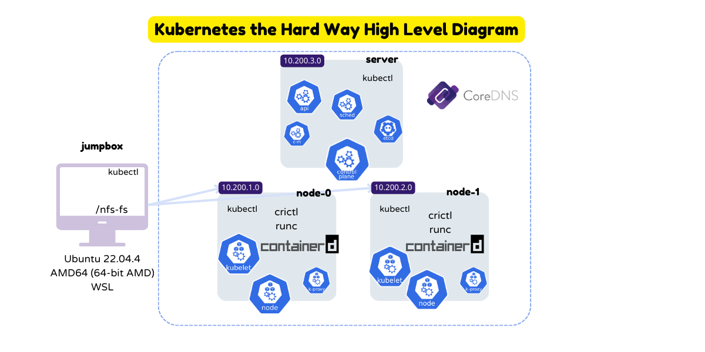
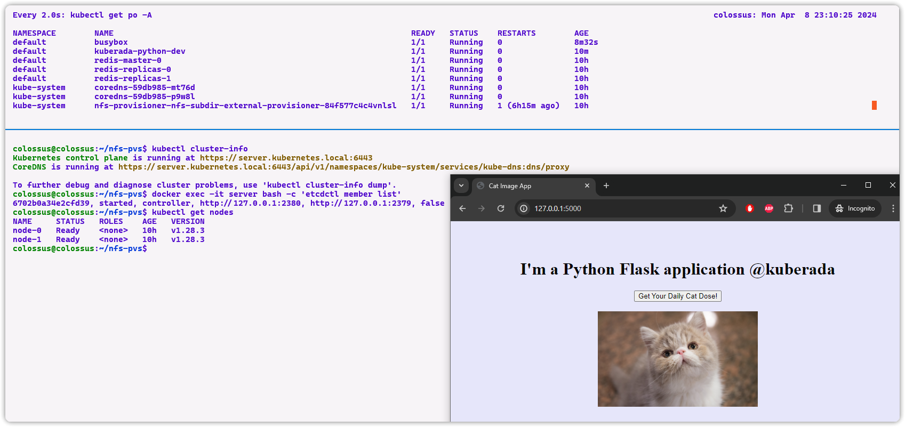

---
myst:
  html_meta:
    "description lang=en": "This comprehensive Kubernetes setup guide delves into configuring a Kubernetes cluster using Kubernetes The Hard Way. Explore Kubernetes components, networking, security practices, and performance optimization. Dive into advanced topics like load balancing and troubleshooting, and discover how managed Kubernetes services from cloud providers simplify cluster management. Whether you're new to Kubernetes or an experienced user, this guide offers valuable insights and actionable tips to enhance your Kubernetes skills."
    "keywords": "Kubernetes setup guide, Kubernetes cluster configuration, Kubernetes networking, Kubernetes security, Kubernetes load balancing, Kubernetes hard way, Kubernetes best practices, Kubernetes troubleshooting, Kubernetes cluster management"
    "property=og:locale": "en_US"
    "property=og:image": "https://raw.githubusercontent.com/colossus06/kuberada-blog/main/og/hard.png"
---


(hard)=
# A High-Level Overview of Kubernetes The Hard Way on WSL

```{article-info}
:avatar: https://raw.githubusercontent.com/colossus06/kuberada-blog/main/og/author.png
:avatar-link: ../../../blogs/authors/gulcan.html
:author: Gulcan Topcu
:date: March 8, 2024
:read-time: 5 min read
:class-container: sd-p-2 sd-outline-light sd-rounded-2 sd-shadow-md
```

🏷️**Tagged with:**

```{button-link} ../../../blogs/tag/kubernetes.html
:color: success
:outline:
:shadow:
kubernetes
```

Grasping the inner workings of Kubernetes can be challenging. Sure, managed Kubernetes services make things easier. But for those who crave a deep understanding of how Kubernetes really works, Kubernetes The Hard Way offers a hands-on approach to setting up a Kubernetes cluster, providing a deeper understanding of its components and their interactions. TThis (mostly) concise,article aims to outline the basic flow of the steps, include some smoke tests on a python flask application (like verifying data at rest encryption, DNS resolving, pod-to-pod communication), and offer various tips. 

We will setup the following cluster:



And we will perfom some actions like:



### Component Versions

- Kubernetes: v1.28.x
- containerd: v1.7.x
- CNI: v1.3.x
- etcd: v3.4.x

### Environment Setup

Using Ubuntu (WSL) as the jumpbox facilitated smooth communication between my host machine and the Kubernetes cluster components.

- Used 3 containers, with Ubuntu (WSL) as the jumpbox.

### Setup Process Overview

- Bootstraping the Cluster: Automated setup of compute resources and client tools using functions and scripts (e.g., image build, network configuration, container pausing).   
- Provision a PKI Infrastructure: Used OpenSSL for each Kubernetes component.
- Authentication and Authorization: Generated Kubernetes configuration files for controller manager, kubelet, kube-proxy, scheduler clients, and admin user.
- Ensured Data Encryption at Rest: Generated an encryption key and copied the encryption config file to master nodes.
- Stored Cluster State: Bootstrapped a three-node etcd cluster and configured it for high availability and secure remote access.
- Bootstraped and Provisioned the Kubernetes Control Plane: Downloaded, extracted, and installed API Server, Scheduler, and Controller Manager binaries. Configured RBAC permissions to allow the Kubernetes API Server to access the Kubelet API on each worker node.
- Provisioned Worker Node Components, runc, container networking plugins, containerd, kubelet, and kube-proxy components.
- Generated a kubeconfig file for kubectl based on the admin user credentials.
- Added network routes for pod to pod communication.
- Installed Cluster-internal DNS server using coreDNS, now my pods could communcate with the cat API
- Setup a local NFS server exposing a directory on my host machine via NFS and installed Kubernetes NFS Subdir External Provisioner

Now you should be able manage the cluster using kubectl (kubectl under the hood).


## Some Tests

- Data at rest encryption and printing a hexdump of the kuberada secret stored in etcd:


- Port forwarding and making an HTTP request using the forwarding address:


- Dns resolution:


### Further Steps

- Implement a Load Balancing Solution: Ensure that communication from the worker nodes to the API server is routed through a load balancer for better availability and scalability. You can use tools like MetalLB or HAProxy to achieve this.

- Set Up a Separate etcd Cluster for High Availability: To improve the reliability of your Kubernetes cluster, consider setting up a separate etcd cluster. This separate cluster will ensure that your Kubernetes control plane remains operational even if one of the etcd nodes fails.

- Improve Networking Performance, Security, and Observability: Replace the default networking and proxy components in your Kubernetes cluster with Cilium. Cilium leverages eBPF (extended Berkeley Packet Filter) technology, providing a more efficient and secure networking layer. It offers advanced features like network visibility, security policies, and load balancing, enhancing the overall performance and security of your Kubernetes cluster.


## CICs(Challenge in Challenge)

- permission Denied for `nf_conntrack_max`: To resolve this issue, increase the maximum number of tracked connections in the netfilter connection tracking system to 655360 and change the permissions of` /etc/sysctl.conf` so that kube-proxy can modify the `nf_conntrack_max` setting.

- `WARNING: No blkio throttle.read_bps_device support` and `Unable to add a process (PID xyz) to a cgroup`: If `docker info | grep Cgroup` command returns v1, it means that some specific features for fine-grained control (throttle.read_bps_device, throttle.write_bps_device, etc.) are not enabled in your current kernel configuration. Upgrade your kernel and reboot WSL.

- Mapping Domain Names to IP Addresses in `/etc/hosts`: Ensure that domain names are correctly mapped to their respective IP addresses in the `/etc/hosts` file. This mapping is crucial for proper communication between components in your Kubernetes cluster.


- Adding Routes for Pod Communication Across Nodes: By adding routes to the node's internal IP address for each worker node's Pod CIDR range, you ensure that pods can reach each other across nodes. This step is essential for the Kubernetes networking model to function correctly.


- nfsd command not found: If you encounter an issue where the nfsd command is not found, you need to enable NFS by updating the kernel and adding the following lines to /etc/wsl.conf. After making these changes, you should be able to use NFS successfully.

`sudo service nfs-kernel-server status`


Get the PV's:


Checking the local path to your NFS shared directory:


I believe it's time to give my hardware a well-deserved break.


<iframe width="560" height="315" src="https://www.youtube.com/embed/33Q1FmBNpQQ?si=Fx2EmzDO3A8B-gSW" title="YouTube video player" frameborder="0" allow="accelerometer; autoplay; clipboard-write; encrypted-media; gyroscope; picture-in-picture; web-share" referrerpolicy="strict-origin-when-cross-origin" allowfullscreen></iframe>

## Conclusion

Setting up a Kubernetes cluster for production is indeed a complex and time-consuming process. It involves various tasks such as renewing SSL certificates, updating the etcd database, upgrading binaries, adding new nodes to the cluster, and managing operating system patching and maintenance. These tasks can be daunting and require significant expertise to handle effectively.

However, there is a solution to this challenge: managed Kubernetes services provided by major cloud providers. These services, such as AKS, GKE, and EKS, offer a simplified way to create, manage, and scale Kubernetes clusters in the cloud. They handle the maintenance tasks, including renewing SSL certificates, updating the etcd database, and managing operating system patches, allowing you to focus on your applications rather than infrastructure management.

On the other hand, if you are looking to gain a deeper understanding of Kubernetes architecture and components, Kubernetes The Hard Way is an invaluable resource. It guides you through the manual setup of a Kubernetes cluster, providing hands-on experience with each component and how they interact.

In conclusion, whether you choose to use a managed Kubernetes service or set up Kubernetes The Hard Way, both options offer valuable learning experiences and can help you gain a better understanding of Kubernetes.

**Enjoyed this read?**

If you found this guide helpful,check our blog archives 📚✨

- Follow me on [LinkedIn](https://www.linkedin.com) to get updated.
- Read incredible Kubernetes Stories: [Medium](https://medium.com/@gulcantopcu)
- Challenging projects: You're already in the right place.

Until next time!


