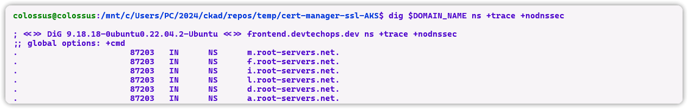

---
myst:
  html_meta:
    "description lang=en": "Learn how to secure your Python application running on Azure Kubernetes Service (AKS) with HTTPS. This comprehensive guide covers deploying NGINX Ingress Controller, setting up Let's Encrypt with Cert-Manager for SSL certificates, configuring DNS records, and deploying your application. Follow these steps to ensure your AKS application is accessed securely over HTTPS."
    "keywords": "AKS, Azure Kubernetes Service, HTTPS, NGINX Ingress Controller, Let's Encrypt, Cert-Manager, SSL certificates, DNS records, Python application, Kubernetes, Terraform, secure application deployment"
    "property=og:locale": "en_US"
    "property=og:image": "https://raw.githubusercontent.com/colossus06/kuberada-blog/main/og/ingress-ssl.png"
---


(ingress-ssl)=
# Secure Your AKS Application with HTTPS: Let's Encrypt Your Way!

```{article-info}
:avatar: https://raw.githubusercontent.com/colossus06/kuberada-blog/main/og/author.png
:avatar-link: ../../../blogs/authors/gulcan.html
:author: Gulcan Topcu
:date: March 21, 2024
:read-time: 5 min read
:class-container: sd-p-2 sd-outline-light sd-rounded-2 sd-shadow-md
```

🏷️**Tagged with:**

```{button-link} ../../../blogs/tag/kubernetes.html
:color: success
:outline:
:shadow:
kubernetes
```

Securing the CI/CD pipeline is crucial, but what about the deployed application? So, in this guide, I will focus on securing a Python application I developed for demo purposes, which serves up those adorable dynamic cat images running on AKS. (More will come on how the whole CICD pipeline and automated deployment looks like in another article...)

So we will achieve this, a secure endpoint for our application:


After the final release step authenticates with the private repository and updates Kubernetes manifests with a new tag, Argo detects these changes and ensures your AKS cluster reflects the latest application state.


We'll leverage the following technologies:


- **NGINX Ingress Controller:** Directs traffic to your application using reverse proxy.
- **Let's Encrypt (CA Cluster Issuer):** Provides free, trusted SSL certificates for your domain.
- **Cert-Manager:** Automates certificate issuance and renewal, securing your HTTPS setup.
- **Domain:** Your unique web address for secure access.
- **Terraform:** Automates infrastructure creation, including resources for HTTPS.


**Prerequisites**


An existing AKS cluster
kubectl configured to access your AKS cluster
A domain name


Before we start:

You can find all the codes used on the following gist:

```{button-link} https://gist.github.com/colossus06/d313aff4aefcbf3ffd2cca002de16fed
:color: success
Ingress SSL Gist 
```

Take a look at the manifest and terraform files I used on this blog:

```{button-link} https://github.com/colossus06/Kuberada-Blog-Labs/tree/main/nginx-ingress-ssl-cert-manager
:color: success
Manifest Files 
```

Now, let's enable HTTPS for secure access! 

## Step 1- Merge the AKS cluster


Configure your local environment to interact with an AKS cluster; it adds new credentials to your KUEBCONFIG file.


`az aks get-credentials --resource-group $AZ_RG --name $CLUSTER`


## Step 2- Deploy the NGINX Ingress Controller


Our Python application needs a secure entry point for incoming traffic because users expect a secure experience. Kubernetes Ingress can help us define how external HTTP and HTTPS requests reach our application within the cluster. In this case, we need a virtual name for our application, which is `frontend.devtechops.dev`.


The NGINX Ingress Controller utilizes a reverse proxy to manage incoming requests and route them to the appropriate service based on defined rules within the Ingress configuration.


```yaml
...
helm upgrade --install ingress-nginx ingress-nginx \
  --repo https://kubernetes.github.io/ingress-nginx \
  --namespace nginx-ingress \
...
```


I used Helm in this demo, but you can also use manifest files.


`https://raw.githubusercontent.com/kubernetes/ingress-nginx/controller-v1.10.0/deploy/static/provider/cloud/deploy.yaml`


A pod pods will be coming up in nginx-ingress namespace:


`k get po -n nginx-ingress`


Now that we have our NGINX Ingress Controller set up, let's ensure secure communication for our application!


## Step 3- Deploy cert-manager


So what is a cert-manager? cert-manager is a tool for managing TLS certificates in Kubernetes clusters. It automates the management and issuance of TLS certificates from various issuers. We have two key layers when it comes to cert-manager: Issuers and Certificates


Issuers: These resources define how certificates will be obtained. Common issuers include Let's Encrypt or integrations with internal Certificate Authorities (CAs) within your organization.


Certificates: Our application will use these actual certificates. They specify the domain name(s) our application uses and reference the chosen Issuer for obtaining the certificate.


You should see a successful output like this:


Now we have installed 2 charts, cert-manager, and nginx ingress controller, on the same namespace:


## Step 4- Create Let's Encrypt Issuer


We will define a ClusterIssuer resource in cert-manager. We will tell cert-manager to use a specific Certificate Authority (CA) to issue TLS certificates for our cluster.
In this case, the CA is Let's Encrypt, a popular free CA that provides TLS certificates.


`envsubst < cluster-issuer.yaml | kubectl apply -f -`


## Step 5 - Configure DNS Records


Get the external IP of the nginx controller and create an A-Record for your domain.


`kubectl get svc -n $INGRESS_NAMESPACE`


`dig $DOMAIN_NAME ns +trace +nodnssec`





## Step 6- Deploy your application and set up Route


It's time to deploy our sample application
We need to tell Ingress to route traffic to our Python application.


Make sure to match the service name of your application on the ingress manifest; that's how Ingress finds out which application to route traffic to.


Let's deploy the application and the ingress resource on the nginx controller’s namespace.


Here comes a tricky part.


When we listed the ingresses, something caught my eye: ingress class was public, cm-acme-http-solver-rcj45 displayed <none>. Let's fix this.


`kubectl patch -n $INGRESS_NAMESPACE ingress <cm-acme-http-solver> --type merge -p '{"spec": {"ingressClassName": "public"}}'`


Now, we're good to go.
One quick validation before destroying the resources:


## Conclusion


In this blog, we've successfully fortified a Python application deployed on AKS. Now, our users can interact with it securely over HTTPS. We leveraged NGINX ingress, Let's Encrypt with Cert-Manager, a domain, and Terraform to automate HTTPS access and certificate management for our secure AKS application.

**Here's a Recap of the Achieved Security Enhancements:**

* **NGINX Ingress Controller:** Secured the entry point for user traffic.
* **Let's Encrypt (CA Cluster Issuer):** Provided free, trusted SSL certificates.
* **Cert-Manager:** Automated certificate issuance and renewal.
* **Domain:** Established a unique, secure access point.

By employing these tools, we've ensured that communication between users and our application is encrypted, safeguarding data transfer.

**Further Bolstering Your Security Posture:**

* **Network Policies:** Restrict communication between pods to enforce a secure architecture. Imagine multiple services: Network Policies can prevent the web tier from directly accessing the database tier, forcing it to communicate through the backend tier.
* **Secrets Management:** Integrate Azure Key Vault to securely store sensitive application data like API keys and database credentials, reducing the attack surface by eliminating secrets from your code.
* **Security Scanning:**  Once we push the image to the registry the secruty scans stop. It shouldn't. There are new vulnerabilities discovered everyday.So, that's why continuous security scanning is crucial. We'll explore this further in our upcoming article, "Designing a Secure Automated CICD Pipeline for Python Applications."

Happy coding!


## Find all the resources used in this blog here: 

- All the codes used:

```{button-link} https://gist.github.com/colossus06/d313aff4aefcbf3ffd2cca002de16fed
:color: success
Ingress SSL Gist 
```
- Manifest and terraform files:

```{button-link} https://github.com/colossus06/Kuberada-Blog-Labs/tree/main/nginx-ingress-ssl-cert-manager
:color: success
Manifest Files 
```

## References


- [Nginx Controller](https://kubernetes.github.io/ingress-nginx/deploy/)
- [Let's Encrypt](https://letsencrypt.org/)
- [Cert-Manager Documentation](https://cert-manager.io/docs/)
- [NGINX Ingress Controller Documentation](https://kubernetes.github.io/ingress-nginx/)
- [Terraform Documentation](https://www.terraform.io/docs/)
- [Azure AKS Documentation](https://docs.microsoft.com/en-us/azure/aks/)
- [Kubernetes Documentation](https://kubernetes.io/docs/)


**Enjoyed this read?**

If you found this guide helpful,check our blog archives 📚✨

- Follow me on [LinkedIn](https://www.linkedin.com/in/gulcantopcu/) to get updated.
- Read incredible Kubernetes Stories: [Medium](https://medium.com/@gulcantopcu)
- Challenging projects: You're already in the right place.

Until next time!