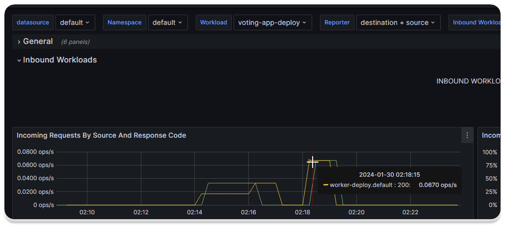

---
myst:
  html_meta:
    "description lang=en": "Explore the potential of Istio, a robust service mesh solution, with our comprehensive guide. Learn how to effortlessly manage microservices, enhance CI/CD processes, and boost observability. Follow step-by-step instructions for Istio installation using istioctl and Helm, ensuring seamless microservices orchestration. Dive into Istio's powerful features and monitor your service mesh with Prometheus and Grafana."
    "keywords": "Kubernetes, hands-on, Gulcan Topcu, Devops, istio, kube-proxy, grafana, prometheus, k3d, istioctl"
    "property=og:locale": "en_US"
    "property=og:image": "https://raw.githubusercontent.com/colossus06/kuberada-blog/main/og/istio.png"
---


 
(istio)=
# Unlocking Istio's Power: A Step-by-Step Guide to Seamless Microservices Management

```{article-info}
:avatar: https://raw.githubusercontent.com/colossus06/kuberada-blog/main/og/author.png
:avatar-link: ../../../blogs/authors/gulcan.html
:author: Gulcan Topcu
:date: Jan 31, 2024
:read-time: 15 min read
:class-container: sd-p-2 sd-outline-light sd-rounded-2 sd-shadow-md
```

🏷️**Tagged with:**

```{button-link} ../../../blogs/tag/kubernetes.html
:color: success
:outline:
:shadow:
kubernetes
```

In the dynamic world of microservices, orchestrating, securing, and monitoring services can be intricate. Istio, a robust service mesh, steps in as the solution, offering a holistic approach to traffic management, security, and observability. We will see 2 different ways to install and get started with istio: with istioctl and helm. Let's dive into the intricacies of Istio and explore two different installation methods: using `istioctl` and Helm.

## In This Article:

1. Install Istio Components
    * Using istioctl
    * Using Helm
2. Enable Automatic Istio Sidecar Injection
3. Validate Istio-Proxy Sidecar Injection
4. Explore Pod Communication
5. Pod Communication Using Service Mesh
6. Monitor Service Mesh with Prometheus and Grafana

## Option 1: Installing Istio with `istioctl`

Begin by downloading Istioctl on Ubuntu:

```sh
curl -L https://istio.io/downloadIstio | sh -
```

Add Istioctl to your path:

```sh
export PATH=$HOME/.istioctl/bin:$PATH
```

Create a cluster with `k3d`:

```sh
k3d cluster create istio
```

Perform the Istio pre-installation check:

```sh
istioctl x precheck
```


Install Istio with the default profile:

```sh
istioctl install
```

Verify the installation:

```sh
istioctl verify-install
```

Uninstall Istio:

```sh
istioctl uninstall --purge
```

## Option 2: Installing Istio with Helm

### Step 1: Install Base Istio Components

Add cluster-wide base components using Helm:

```sh
helm repo add istio https://istio-release.storage.googleapis.com/charts
helm repo update
helm search repo istio
```


Customize default values:

```sh
helm show values istio/base
helm show values istio/istiod
```

Install CRDs and Istio control plane components:

```sh
k create ns istio-system
helm install istio-base istio/base -n istio-system
helm install istiod istio/istiod -n istio-system
```


Check installed Helm charts:

```sh
k get po -n istio-system
helm ls -n istio-system
```


### Step 2: Enable Automatic Istio Sidecar Injection

Automate sidecar injection by labeling pods:

```sh
k label ns default istio-injection=enabled
```

Deploy the voting app resources with Helm:

```sh
helm repo add voting-app-istio https://gitlab.com/api/v4/projects/54113378/packages/helm/stable
helm repo update
helm search repo voting-app-istio
helm upgrade --install voting-app --set image.tag=latest voting-app-istio/charts
```


### Step 3: Validate Istio-Proxy Sidecar Injection

Describe the voting-app pod to validate Istio-proxy sidecar injection:

```sh
k describe po worker-app | less
```


### Step 4: Exploring Current Pod Communication

Identify NodePort and ClusterIP services:


Shell into a pod and access a NodePort service:

```sh
k exec worker-deploy-7c4c4bc5bc-w4szc -it -- sh
apt update
apt install -y curl;curl voting-service
```


Use port-forwarding for communication:

```sh
k port-forward svc/voting-service 30004:80
```

Explore pod communication over kube-proxy.

### Step 5: Communicate Using Service Mesh

Delete kube-proxy and check if pods can still communicate over the service mesh:

```sh
k get ds -A
k delete ds kube-proxy -n kube-system
```

```sh
k exec worker-deploy-7c4c4bc5bc-w4szc -it -- curl voting-service
```


## Monitoring Service Mesh Using Prometheus and Grafana


```{tip}
  You can find the grafana-value.yaml file on  [blog's repository](https://github.com/kuberada/kuberada-labs/tree/main/get-started-with-istio). Clone the repo and change directory into `get-started-with-istio`.
```

**Find the labs here** 👇

```{button-link} https://github.com/kuberada/kuberada-labs
:color: success
Kuberada labs
```

Now that you know where to find the custom grafana yaml file, we're ready to create a monitoring stack for observing pod traffic.

**Adding and updating the repos:**

```sh
helm repo add prometheus-community https://prometheus-community.github.io/helm-charts
helm repo add grafana https://grafana.github.io/helm-charts
```

**Installing Prometheus and Grafana:**

```sh
helm install prometheus prometheus-community/prometheus -n monitoring --create-namespace
helm install grafana grafana/grafana -n monitoring -f "grafana-value.yaml"
```


**Importing Istio Workload Dashboard:**

Login to Grafana, append `/dashboard/import` to the URL, type `7630` to import the Istio workload dashboard, and select Prometheus as the data source.


Connect to the worker service and communicate with the voting-service:

```sh
k exec worker-deploy-7c4c4bc5bc-w4szc -it -- curl voting-service
k exec worker-deploy-7c4c4bc5bc-w4szc -it -- curl result-service
```


Select both source and destination for the reporter and examine the inbound traffic:


**Displaying the outgoing traffic from worker app:**

Intercepted traffic over the Istio proxy, displaying outgoing requests from `worker-deploy` to `voting-service` and `result-service`.


**Displaying the incoming requests in result and voting apps:**

Incoming requests to result app by worker app:


Incoming requests to the voting app:



## Cleaning

Delete all the resources you used in this lab:

```sh
k delete ns monitoring
k delete ns istio-system
helm uninstall voting-app
```


## Recap

In this blog, we have successfully set up Istio on our Kubernetes cluster and explored its powerful features for traffic management and observability. Use this hands-on guide as a foundation for further experimentation and Istio integration into your microservices architecture. Happy meshing!

### References

- [Istio Architecture](https://istio.io/latest/docs/ops/deployment/architecture/)
- [Istio Releases](https://istio.io/latest/news/releases/)
- [Istioctl profiles](https://istio.io/v1.1/docs/setup/kubernetes/additional-setup/config-profiles/)
- [Kubernetes Documentation](https://kubernetes.io/docs/)
- [Istio Documentation](https://istio.io/latest/docs/)
- [Helm Documentation](https://helm.sh/docs/)
- [Grafana Istio Workload Dashboard](https://grafana.com/grafana/dashboards/7630-istio-workload-dashboard/)

Happy meshing!


👉 For a wealth of knowledge, check our blog archives.📚✨


<div style="text-align: center;">
  <h2>Did you like kuberada? 🐶 </h2>
</div>

<br>

<div class="sharethis-inline-reaction-buttons"></div>