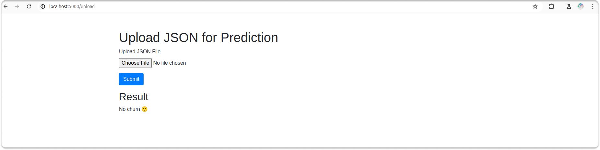
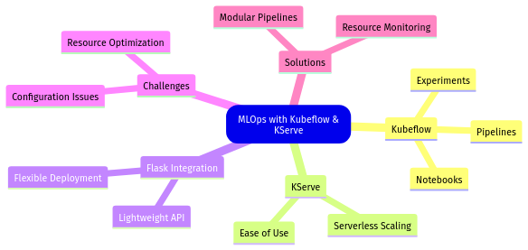
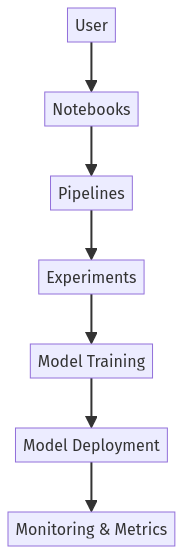
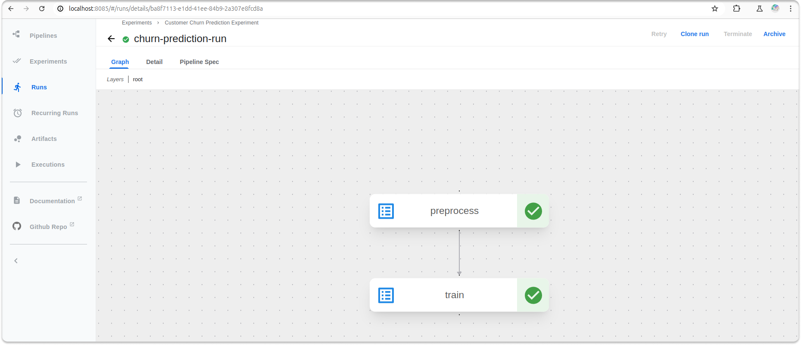
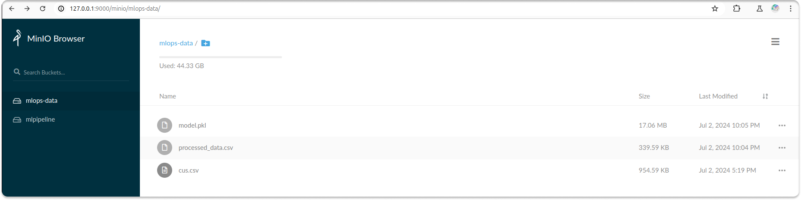
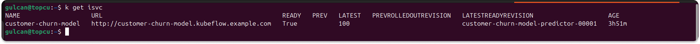
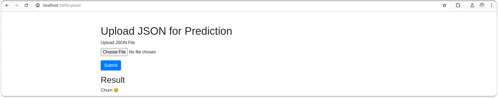

---
myst:
  html_meta:
    "description lang=en": "Explore how to revolutionize your MLOps pipeline with Kubeflow and KServe in our detailed guide. Learn to predict customer churn using Flask, streamline model deployment, and enhance scalability. Follow our step-by-step instructions to implement efficient MLOps workflows and monitor your deployments with Prometheus and Grafana."
    "keywords": "MLOps, Kubeflow, KServe, customer churn prediction, Flask, Kubernetes, microservices, DevOps, Gulcan Topcu, model deployment, scalability, CI/CD, observability, Prometheus, Grafana, machine learning, ML workflows, model serving, serverless MLOps, automation, data-driven businesses, end-to-end MLOps, Kubernetes-native, resource optimization, deployment guide, step-by-step instructions, monitoring tools."
    "property=og:locale": "en_US"
    "property=og:image": "https://raw.githubusercontent.com/colossus06/kuberada-blog/main/og/mlops.png"
---


 
(mlops)=
# Transforming MLOps with Kubeflow & KServe: Churn Prediction

```{article-info}
:avatar: https://raw.githubusercontent.com/colossus06/kuberada-blog/main/og/author.png
:avatar-link: ../../../blogs/authors/gulcan.html
:author: Gulcan Topcu
:date: Jul 3, 2024
:read-time: 12 min read
:class-container: sd-p-2 sd-outline-light sd-rounded-2 sd-shadow-md
```

🏷️**Tagged with:**

```{button-link} ../../../blogs/tag/kubernetes.html
:color: success
:outline:
:shadow:
kubernetes
```

As a Kubernetes wrangler, you have probably heard the buzz about MLOps and its potential to revolutionize data-driven businesses. While the potential ROI is significant (reducing churn by a mere 5% can boost profits by 25-95% [^1]) , building and maintaining effective MLOps pipelines can be daunting, especially if you're new to the machine learning world.

In this guide, I'll show you how to effectively use Kubeflow, KServe, and Flask to predict customer churn.




Traditional MLOps workflows often grapple with several pain points, such as:
* Scalability: Managing the growing volume of data and models.
* Infrastructure Management: Maintaining and scaling the underlying infrastructure.
* Model Deployment Complexity: Seamlessly integrate and deploy models into production.
* High Costs: Managing operational costs effectively.

Enter Kubeflow, an end-to-end MLOps platform that streamlines machine learning workflows, and KServe, its serverless model deployment component. 

Together, they offer a robust solution to these challenges. I'll also utilize Flask to build the model's API, making it easy to integrate with KServe.



## Why MLOps Matters

Efficient MLOps practices can significantly impact businesses:
* Accelerates the time from model development to deployment.
* Enhances the ability to retrain and optimize models.
* Facilitates the handling of large-scale data and model training.
* Leads to more informed decision-making and competitive advantage.

Kubernetes is a popular choice for MLOps due to:
* Efficiently manages resources and scales applications.
* Ensures optimal usage of computing resources.
* Allows for easy deployment across different environments.

## Kubeflow Overview

Kubeflow comprises several components that support the entire ML lifecycle:


* Pipelines: Automates the workflow from data ingestion to model deployment.
* Notebooks: Provides an interactive environment for data scientists to experiment and develop models.
* Experiments: Tracks and manages different model versions and experiments.



Kubeflow simplifies:
* Experiment Tracking: Keeps track of different experiments and their outcomes.
* Model Versioning: Manages multiple versions of a model efficiently.
* Pipeline Orchestration: Automates and orchestrates complex ML workflows.


## KServe & Serverless MLOps

KServe is a Kubernetes-native model-serving framework that simplifies model deployment and scaling. It offers:
* Serverless Scaling: Automatically scales resources based on demand.
* Ease of Use: Simplifies the process of deploying and managing models.

Serverless MLOps offers several advantages:
* Reduced Operational Overhead: Minimizes the need for manual infrastructure management.
* Automatic Scaling: Adjusts resources based on workload, ensuring efficient resource utilization.
* Cost-Effectiveness: Only pays for the resources used, reducing overall costs.

## Case Study: Churn Prediction Project

I used Flask to create a lightweight and flexible API for the model. This integration makes it easy to deploy and manage the model with KServe.


### What is Churn?

Churn prediction helps businesses identify customers likely to leave, allowing them to take proactive measures. I use a telco dataset containing customer data and churn status for this case study.

I designed a Kubeflow pipeline to automate the entire process:

```python
import kfp
from kfp import dsl

def preprocess_op():
    return dsl.ContainerOp(
        name='Preprocess Data',
        image='myrepo/preprocess:latest',
        command=['python', 'preprocess.py']
    )

def train_op():
    return dsl.ContainerOp(
        name='Train Model',
        image='myrepo/train:latest',
        command=['python', 'train.py']
    )

@dsl.pipeline(
    name='Customer Churn Prediction Pipeline',
    description='An example pipeline for customer churn prediction.'
)
def churn_prediction_pipeline():
 preprocess_task = preprocess_op()
 train_task = train_op().after(preprocess_task)

if __name__ == '__main__':
 kfp.compiler.Compiler().compile(churn_prediction_pipeline, 'churn_prediction_pipeline.yaml')
```



### Flask Web App

The Flask web app communicates with the model, analyzes user-uploaded JSON files, and returns the churn prediction result.

```python
from flask import Flask, request, jsonify
import requests

app = Flask(__name__)

@app.route('/predict', methods=['POST'])
def predict():
 data = request.json
 response = requests.post('http://kserve-model:8080/v1/models/customer-churn:predict', json=data)
 result = response.json()
    if result['predictions'][0] == 1:
        return jsonify({"prediction": "😢 Churn"})
    else:
        return jsonify({"prediction": "🙂 No churn"})

if __name__ == '__main__':
 app.run(debug=True)
```

Let's simulate a customer profile that is more likely to churn. 

```json
      {
        "gender": 0,
        "SeniorCitizen": 1,
        "Partner": 0,
        "Dependents": 0,
        "tenure": 1,
        "PhoneService": 1,
        "MultipleLines": 0,
        "InternetService": 1,
        "OnlineSecurity": 0,
        "OnlineBackup": 0,
        "DeviceProtection": 0,
        "TechSupport": 0,
        "StreamingTV": 0,
        "StreamingMovies": 0,
        "Contract": 0,
        "PaperlessBilling": 1,
        "PaymentMethod": 2,
        "MonthlyCharges": 95.75,
        "TotalCharges": 95.75
      }
```

This customer exhibits a profile that is likely to churn.

Why?

We have observed that the customer is still in the early stages of their relationship with the company and may not be fully committed and has the flexibility to leave at any time, making them more likely to churn.

It's crucial to remember that this is a prediction based on a single data snapshot. To make a more accurate churn prediction, it's essential to analyze the customer's behavior over time and consider other factors like customer service interactions, promotions, and competitor offerings.


For this tutorial, we verified that our churn prediction model is trained and performing well on the dataset. 

I also have a finalized model artifact (e.g., a serialized model file) ready to package for deployment.



### Why KServe?

I want to focus on our model's business logic and integration with other applications rather than worrying about the underlying infrastructure details. 

Deploying the Flask-based model on KServe is straightforward:

```yaml
apiVersion: "serving.kserve.io/v1beta1"
kind: "InferenceService"
metadata:
  name: customer-churn-model
  namespace: kubeflow
spec:
  predictor:
    serviceAccountName: sa-minio-kserve
    sklearn:
      storageUri: "s3://mlops-data/model.pkl"
```



Once I port forward the model endpoint, it is accessible and ready to be used for predictions. 

We can interact with it programmatically (e.g., from our application's backend) or through tools like curl or Postman.

```yaml
curl -X POST \
  http://localhost:8080/v1/models/customer-churn-model:predict \
  -H 'Content-Type: application/json' \
  -d @input.json
```

Using flask based webapp:



## Key Takeaways from Our Practical Implementation

* Manual management of ML workflows was time-consuming, prone to errors, and required significant developer effort. With Kubeflow Pipelines, we automated the entire process, reducing workflow management time and decreasing errors. This automation freed up developers to focus on model development and optimization.

* Deploying models manually resulted in inconsistent performance, frequent downtime, and scalability issues during high load periods. KServe provided automatic scaling and efficient resource utilization, resulting in improved model response time and reduced downtime during peak usage.

* Integrating the model with applications was cumbersome, with slow response times affecting user experience. The Flask API integration streamlined interactions, improving response times and simplifying the integration process, which reduced development time.

* Over-provisioning resources led to high operational costs, with many underutilized resources needing to be utilized. Implementing a serverless architecture with KServe reduced resource costs by 40%, as resources were automatically scaled based on demand, ensuring optimal utilization.

* The ML lifecycle stages were disjointed, causing delays and inconsistencies across data ingestion, preprocessing, training, and deployment. Kubeflow's end-to-end automation reduced the time to deploy a new model version from weeks to days, improving consistency and reducing manual intervention.

**Enjoyed this read?**

If you found this guide helpful,check our blog archives 📚✨

* Follow me on [LinkedIn](https://www.linkedin.com) to get updated.
* Read incredible Kubernetes Stories: [Medium](https://medium.com/@gulcantopcu)
* Challenging projects: You're already in the right place.

Until next time!

[^1]: [Harvard Business Review: The Value of Keeping the Right Customers](https://hbr.org/2014/10/the-value-of-keeping-the-right-customers)


