---
myst:
  html_meta:
    "description lang=en": "Master Kubernetes workload selection with this hands-on guide. Explore practical examples and a mindmap to simplify complex concepts like Deployments, StatefulSets, DaemonSets, CronJobs, and Jobs. Discover unexpected insights into their resilience, versatility, and power.  Level up your Kubernetes expertise and build applications that thrive"
    "keywords": "Kubernetes, Workloads, Deployments, StatefulSets, DaemonSets, CronJobs, Jobs, Pod Disruption Budgets, Horizontal Pod Autoscaling, Init Containers, Sidecar Containers, Resource Management, Application Resilience, Scalability, Efficiency, Cloud Native, Kubernetes Tutorial, DevOps"
    "property=og:locale": "en_US"
    "property=og:image": "https://raw.githubusercontent.com/colossus06/kuberada-blog/main/og/workloads.png"
---


 
(workloads)=
# Choosing the Perfect Kubernetes Workload: A Practical Guide for Application Success

```{article-info}
:avatar: https://raw.githubusercontent.com/colossus06/kuberada-blog/main/og/author.png
:avatar-link: ../../../blogs/authors/gulcan.html
:author: Gulcan Topcu
:date: Jul 12, 2024
:read-time: 20 min read
:class-container: sd-p-2 sd-outline-light sd-rounded-2 sd-shadow-md
```

🏷️**Tagged with:**

```{button-link} ../../../blogs/tag/kubernetes.html
:color: success
:outline:
:shadow:
kubernetes
```

Choosing the optimal Kubernetes workload can be a critical factor in the success of your application deployment. Mismatched workloads often lead to performance bottlenecks, unnecessary complexity, and wasted resources.

This comprehensive guide is designed to streamline your decision-making process. We begin with a mindmap offering a high-level overview of the diverse Kubernetes workload landscape, including Deployments, StatefulSets, DaemonSets, CronJobs, Jobs and more. 

This visual aid serves as your roadmap to understanding the unique characteristics and ideal use cases of each workload type.


Let's delve deeper into these workload types.

* Deployments: These are your go-to solution for managing stateless applications, ensuring high availability, and seamless scaling.
* StatefulSets: Ideal for applications requiring persistent storage and stable network identities, StatefulSets are crucial for maintaining data consistency and reliability.
* DaemonSets: Designed to run a pod on every node in your cluster, these are perfect for essential system-level tasks like logging and monitoring.
* CronJobs: Automate your scheduled tasks with CronJobs, ensuring timely backups, batch processing, and other recurring operations.
* Jobs: If you need to execute tasks that run to completion, such as data processing or short-lived scripts, Jobs are your solution.

Understanding these distinct workload types is the first step towards optimizing your Kubernetes deployments and ensuring your applications perform at their best.

Now, let's explore some specific scenarios where these workloads shine, demonstrating their real-world applications.

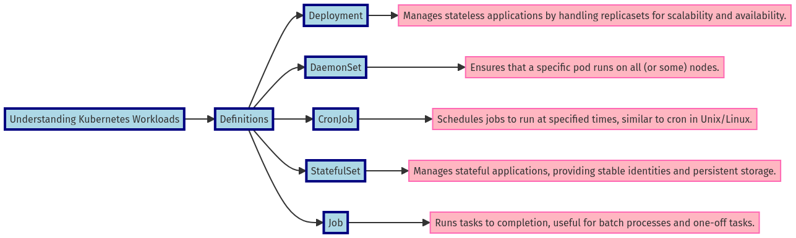

## Practical Use Cases: Putting Kubernetes Workloads to Work

### Scenario: Scaling Your Web Application (Deployment)

Imagine you're running a web application that demands high availability, effortless scalability, and swift recovery from failures. 

Kubernetes Deployments are the perfect solution for this scenario.

**Why Deployments?**

Deployments excel at managing replica sets, rollouts, and rollbacks, ensuring your stateless application remains highly available and resilient to failures.

The YAML manifest below demonstrates how a Deployment can be configured to create three replicas of your web application, providing redundancy and the ability to scale horizontally. 

The deployment mechanism ensures smooth, zero-downtime updates and automatically replaces failed pods, guaranteeing uninterrupted service.

```yaml
# Scaling Your Web Application (Deployment)
# The Deployment ensures high availability and self-healing for stateless applications.
apiVersion: apps/v1
kind: Deployment
metadata:
  name: webapp
  namespace: kuberada
spec:
  replicas: 3  # Specifies three replicas for redundancy and horizontal scaling.
  selector:
    matchLabels:
      app: web
  template:
    metadata:
      labels:
        app: web
    spec:
      containers:
      - name: mywebapp
        image: nginx:latest  # Container image for the web application.

#an imperative alternative would be
kubectl create deployment webapp --image=nginx -n kuberada
kubectl get po <pod-name> -n kuberada -o jsonpath='{.spec.containers[*].name}'


# Update the Deployment (zero-downtime)
kubectl set image deployment/webapp mywebapp=nginx:1.19.2
kubectl rollout status deployment/webapp 

#get the revisions
kubectl rollout history deployment webapp


# Test Self-Healing
kubectl delete pod <pod-name>
kubectl get pods  # Verify new pod is created

#manual scaling
kubectl scale deployment webapp --replicas=2 -n kuberada
```

Let's roll out the nginx 1.19.2 version for our web app deployment. 

```bash
gulcan@topcu:~$ k rollout history deployment webapp 
deployment.apps/webapp 
REVISION  CHANGE-CAUSE
1         <none>  # revision of initial creation
2         <none>  # image name change revisiom
```

You can also scale the replicas to 2 manually. All you're doing is to edit the spec.replicas section to the value you desire.

Yes you can edit the live object too.

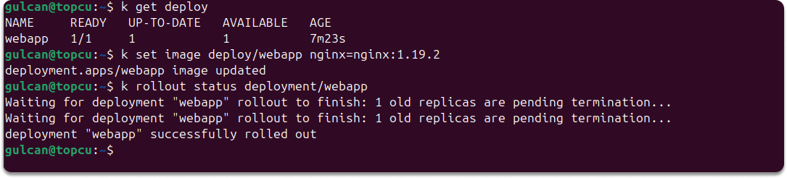

Now our deployment controls 2 replicas and exit status from kubectl rollout is 0.

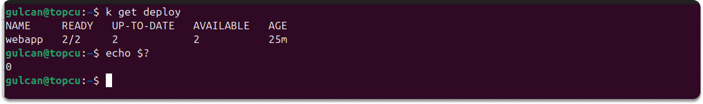

This quick demo takes us further and explores some advanced Deployment techniques that can elevate your Kubernetes knowledge.

## Taking Deployments to the Next Level: Mastering Advanced Techniques

Kubernetes Deployments offer robust features beyond essential replica management. Let's delve into these advanced techniques to optimize your deployments for resilience, scalability, and resource efficiency:

### Pod Disruption Budgets (PDBs): Ensuring High Availability During Disruptions

Imagine a scenario where an unexpected node failure or a cluster upgrade could disrupt your web application. Pod Disruption Budgets (PDBs) come to the rescue by ensuring a minimum number of pods remain available during such events, safeguarding your application from outages.


```yaml
apiVersion: policy/v1
kind: PodDisruptionBudget
metadata:
  name: webapp-pdb
spec:
  minAvailable: 2  # Ensures at least 2 pods are always available.
  selector:
    matchLabels:
      app: web
```

In this example, `minAvailable: 2` guarantees that at least two replicas of your web application are always running, even during maintenance. minAvailabe can be either an absolute number or a percentage. 

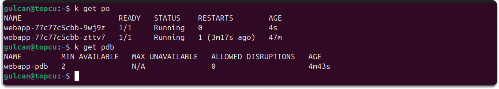

Since we want to protect my webapp deployment with a PDB, we must ensure that the .spec.selector in the deployment manifest is the same. 

### Horizontal Pod Autoscaling (HPA): Dynamic Scaling for Varying Loads

As your web application's traffic fluctuates, manually scaling pods can become cumbersome. Horizontal Pod Autoscaling (HPA) automates this process by dynamically adjusting the number of pods based on metrics like CPU usage. This ensures your application has the resources it needs without over-provisioning.


Let's add CPU and memory resource requests.

```yaml
apiVersion: apps/v1
kind: Deployment
metadata:
  name: webapp
  namespace: kuberada
spec:
  replicas: 2
  selector:
    matchLabels:
      app: web
  template:
    metadata:
      labels:
        app: web
    spec:
      containers:
      - name: mywebapp
        image: nginx:latest
        requests:
          memory: "64Mi"
          cpu: "100m"
        limits:
          memory: "128Mi"
          cpu: "200m"
---
apiVersion: v1
kind: Service
metadata:
  name: webapp-svc
  labels:
    app: web
spec:
  ports:
  - port: 80
  selector:
    app: web
```


```yaml
apiVersion: autoscaling/v2beta2
kind: HorizontalPodAutoscaler
metadata:
  name: webapp
  namespace: kuberada
spec:
  scaleTargetRef:
    apiVersion: apps/v1
    kind: Deployment
    name: webapp
  minReplicas: 3
  maxReplicas: 7
  metrics:
  - type: Resource
    resource:
      name: cpu
      target:
        type: Utilization
        averageUtilization: 50  # Target 50% CPU utilization.

#running metrics server using helm
helm repo add metrics-server https://kubernetes-sigs.github.io/metrics-server/
helm repo update
helm upgrade --install --set args={--kubelet-insecure-tls} metrics-server metrics-server/metrics-server --namespace kube-system

#deploying hpa
kubectl apply -f web-app-hpa.yaml
kubectl get hpa

#an imperative alternative would be
kubectl autoscale deploy webapp --cpu-percent=50 --min=3 --max=7

#check the current status of the hpa
kubectl get hpa

kubectl run -i --tty load --rm --image=busybox:1.36 --restart=Never -- /bin/sh -c "watch -n 0.000001 wget -q -O- http://webapp-svc"

kubectl get hpa webapp-hpa --watch
```

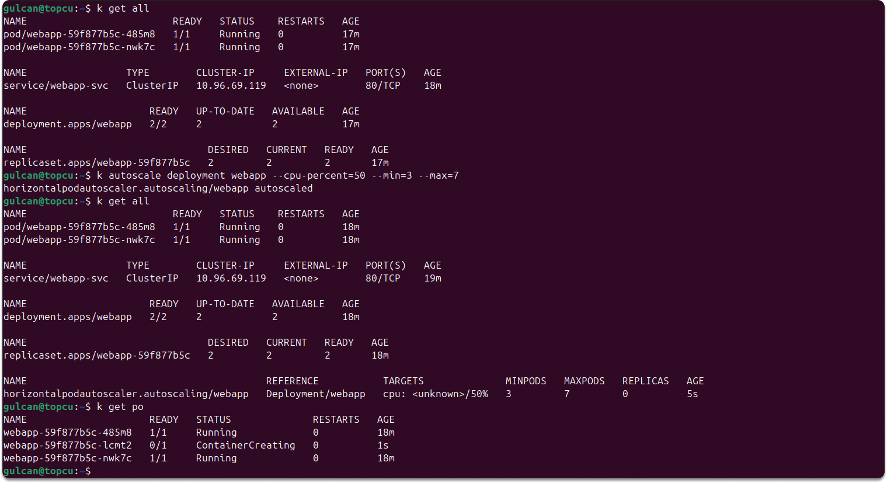

This HPA scales between 3 and 7 replicas of our webapp deployment based on CPU utilization to match demand (aiming for 50%). You can explore autoscaling on multiple metrics.

Once we created the hpa, the replicas scaled up to 3 (athough we specified 2 in the deployment file).

It's time to see how our application behaves under expected load conditions. 

```bash
webapp   Deployment/webapp   cpu: 36%/50%   3         7         3          10m
webapp   Deployment/webapp   cpu: 35%/50%   3         7         3          10m
webapp   Deployment/webapp   cpu: 44%/50%   3         7         3          11m
webapp   Deployment/webapp   cpu: 51%/50%   3         7         3          11m
webapp   Deployment/webapp   cpu: 53%/50%   3         7         3          11m
webapp   Deployment/webapp   cpu: 57%/50%   3         7         3          11m
webapp   Deployment/webapp   cpu: 66%/50%   3         7         4          12m
webapp   Deployment/webapp   cpu: 57%/50%   3         7         4          12m
webapp   Deployment/webapp   cpu: 55%/50%   3         7         5          12m
webapp   Deployment/webapp   cpu: 50%/50%   3         7         5          12m
webapp   Deployment/webapp   cpu: 44%/50%   3         7         5          13m
webapp   Deployment/webapp   cpu: 45%/50%   3         7         5          13m
```

We generated load with a busybox client. Autoscaling the replicas took a couple of minutes. We saw the CPU increase to 66%, and the deployment was gradually resized to 4 and 5 replicas. 

Then we stopped the load testing, since there was no active clients CPU turned back to 0 after a couple minutes , replicas also scaled down to 3 (as we specified in the hpa's spec.minReplicas section)

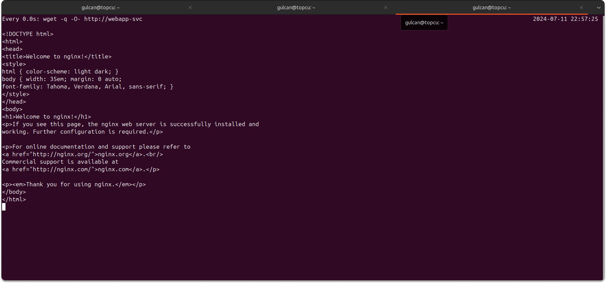


```bash
gulcan@topcu:~$ k get hpa webapp --watch
NAME     REFERENCE           TARGETS       MINPODS   MAXPODS   REPLICAS   AGE
webapp   Deployment/webapp   cpu: 1%/50%   3         7         5          20m
webapp   Deployment/webapp   cpu: 0%/50%   3         7         5          20m
webapp   Deployment/webapp   cpu: 0%/50%   3         7         5          23m
webapp   Deployment/webapp   cpu: 0%/50%   3         7         4          24m
webapp   Deployment/webapp   cpu: 0%/50%   3         7         4          24m
webapp   Deployment/webapp   cpu: 0%/50%   3         7         3          24m
webapp   Deployment/webapp   cpu: 0%/50%   3         7         3          25m
```

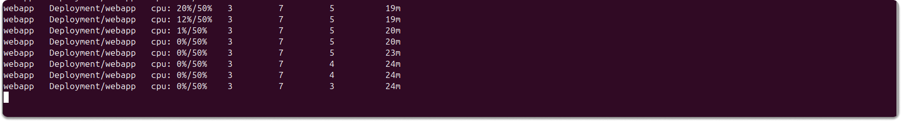


### Resource Limits and Requests: Fine-Tuning Resource Allocation

Kubernetes allows you to specify your pods' resource limits (maximums) and requests (guarantees). This prevents resource contention and ensures your applications have the necessary resources without over-consuming them.


```yaml
...
  requests:
    memory: "64Mi"
    cpu: "100m"
  limits:
    memory: "128Mi"
    cpu: "200m"
```

Our deployment requests 64MiB memory and 100 milliCPU, with limits of 128MiB and 200 milliCPU per pod.


### Init Containers: Preparing the Environment for Your Application

Init containers are specialized containers that run *before* your main application container. They're perfect for tasks like fetching configuration files, initializing databases, or setting up the environment.

**Example Deployment with Init Container (app-with-init.yaml):**

```yaml
apiVersion: apps/v1
kind: Deployment
metadata:
  name: app-with-init
# ... (rest of the manifest is the same as before)
    spec:
      volumes:
      - name: shared-logs
        emptyDir: {}
      initContainers:
      - name: init-myservice
        image: busybox:1.36
        command:
          - 'sh'
          - '-c'
          - 'mkdir -p /var/log/nginx && echo "Init container started" > /var/log/nginx/init.log && chmod -R 777 /var/log/nginx && for i in $(seq 1 20); do echo "Init container is running $i" >> /var/log/nginx/init.log; sleep 1; done'
        volumeMounts:
        - name: shared-logs
          mountPath: /var/log
      containers: 
        # ... your main container definition
        volumeMounts:
        - name: shared-logs
          mountPath: /var/log

#display the logs of the init container
kubectl logs <pod-name> -c init-myservice -n kuberada
```
Let's add an init container to our webapp deployment.

shared-logs is an emptyDir volume that provides shared storage that is accessible to all containers in the pod. It is ephemeral and will be lost when the pod is removed.

The init container creates the directory /var/log/nginx if it doesn't exist, sets permissions, appends 20 messages to /var/log/nginx/init.log, and pauses for 1 second between each iteration. 

We didn't specify and resource request and limit for the init container because they share the same resources as the main container.

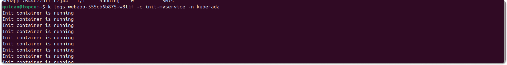

### Sidecar Containers: Enhancing Your Application with Auxiliary Tasks

Sidecar containers run alongside your main application container, providing complementary functionality like logging, monitoring, or service mesh integration.


```yaml
apiVersion: apps/v1
kind: Deployment
metadata:
  name: app-with-sidecar
# ... (rest of the manifest is the same as before)
    spec:
      containers:
      - name: main-container
        # ... your main container definition
      - name: log-reader
        image: busybox:1.36
        command: ['sh', '-c', 'tail -f /var/log/init.log']
        volumeMounts:
        - name: shared-logs
          mountPath: /var/log
        resources:
          requests:
            memory: "64Mi"
            cpu: "100m"
          limits:
            memory: "128Mi"
            cpu: "200m"

#get all the container running in a deployment
kubectl get deploy webapp -n kuberada -o jsonpath='{.spec.template.spec.containers[*].name}'

#check the shared volume
kubectl exec -it <pod-name> -c mywebapp -n kuberada -- sh

#check the logs of the init container
kubectl logs <pod-name> -c init-myservice -n kuberada
```

Now we have one init and two containers (main app is nginx and a busybox as a sidecar) in our deployment. Let's read the messages init container written to init.log.

Upon accessing the contents of init.log from the log-reader container, we verified that our sidecar container continuously displayed new entries from the init.log file.

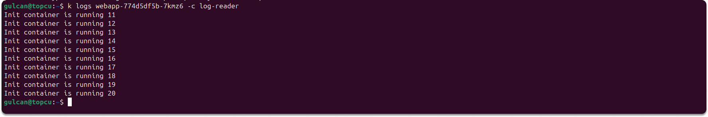


Now, let's shift our focus to DaemonSets, another powerful workload type designed for specific use cases.

#### Monitoring Every Node (DaemonSet)

A logging or monitoring agent must run on every node in your cluster.

DaemonSets guarantee that one pod runs on each node, including newly added nodes, making them ideal for system-level tasks.

This DaemonSet ensures a monitoring agent is deployed on every node, providing node-specific monitoring and log collection essential for system health.

```yaml
# Monitoring Every Node (DaemonSet)
# DaemonSet ensures a pod is run on each node for system-level tasks like monitoring.

apiVersion: apps/v1
kind: DaemonSet
metadata:
  name: monitoring-agent
spec:
  selector:
    matchLabels:
      app: monitor
  template:
    metadata:
      labels:
        app: monitor
    spec:
      containers:
      - name: monitor-container
        image: prom/prometheus:latest  # Container image for the monitoring agent.

# Apply the DaemonSet
kubectl apply -f monitoring-agent-daemonset.yaml

# Verify DaemonSet and the pods running on each node
kubectl get daemonsets
kubectl get pods -o wide
```

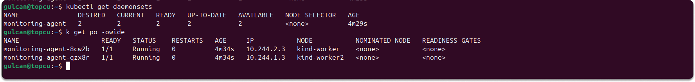

We created a 3 node cluster, installed prometheus monitoring agent and verified automatic scheduling of the ds pod.


#### Scheduled Tasks (CronJob)

You need to run a nightly database backup.

CronJobs allow you to schedule jobs to run at specified times, automating repetitive tasks.

This CronJob schedules a backup to run every night at midnight, ensuring regular and automated database backups without manual intervention.

```yaml
# Scheduled Tasks (CronJob)
# CronJob schedules jobs to run at specified times, automating repetitive tasks.

apiVersion: batch/v1
kind: CronJob
metadata:
  name: log-deletion
  namespace: kuberada
spec:
  schedule: "0 0 * * *"  # Schedule to run every day at midnight.
  jobTemplate:
    spec:
      template:
        spec:
          failedJobsHistoryLimit: 0
          containers:
          - name: log-cleaner
            image: busybox:1.36
            command:
              - 'sh'
              - '-c'
              - 'find /var/log/nginx -type f -name "*.log" -mtime +7 -delete'
            volumeMounts:
            - name: shared-logs
              mountPath: /var/log/nginx
          restartPolicy: OnFailure
          volumes:
          - name: shared-logs
            emptyDir: {}

# Apply the CronJob
kubectl apply -f nightly-backup-cronjob.yaml

#an imperative alternative would be
kubectl create cronjob log-deletion --schedule="0 0 * * *" --image=busybox:1.36 -n kuberada -- /bin/sh -c 'find /var/log/nginx -type f -name "*.log" -mtime +7 -delete'


# Verify CronJob and check its history after midnight
kubectl get cronjobs
kubectl get jobs

#Manually trigger the CronJob to run the log deletion job
kubectl create job --from=cronjob/log-deletion manual-log-deletion -n kuberada


# Monitor the job execution and review logs
kubectl logs <job-pod-name>
```

The schedule for a CronJob in Unix-like systems (including Kubernetes) is specified using five fields that define the time and frequency of execution. Each field can contain specific values, ranges, or special characters to define the schedule. 

For instance, we can use * * * * * for every minute, */5 * * * * for every 5 minutes or 0 12 * * * for everyday at noon.

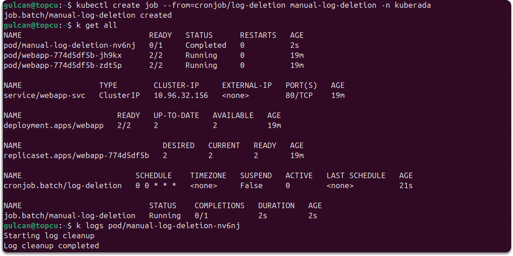

Our cj is scheduled to delete the logs everyday 12:00 AM (midnight) in the 24-hour clock system with keeping the failed job history limit to none, default is one.

```scss
* * * * *
│ │ │ │ │
│ │ │ │ └─── Day of the week (0 - 7) (Sunday = 0 or 7)
│ │ │ └───── Month (1 - 12)
│ │ └─────── Day of the month (1 - 31)
│ └───────── Hour (0 - 23)
└─────────── Minute (0 - 59)
```

#### Stateful Applications (StatefulSet)

You're deploying a distributed database that requires persistent storage and ordered pod deployment.

StatefulSets manage stateful applications by providing stable network identities, persistent storage, and ordered scaling.

This StatefulSet ensures each database pod has a unique identifier, stable storage, and maintains order during scaling and updates, crucial for data integrity and consistency.

```yaml
# Stateful Applications (StatefulSet)
# StatefulSet manages stateful applications, providing stable identities and persistent storage.

apiVersion: apps/v1
kind: StatefulSet
metadata:
  name: mysql
  namespace: kuberada
spec:
  serviceName: "mysql"
  replicas: 3
  selector:
    matchLabels:
      app: mysql
  template:
    metadata:
      labels:
        app: mysql
    spec:
      containers:
      - name: mysql
        image: mysql:5.7
        env:
        - name: MYSQL_ROOT_PASSWORD
          value: kuberada
        ports:
        - containerPort: 3306
          name: mysql
        volumeMounts:
        - name: mysql-persistent-storage
          mountPath: /var/lib/mysql
        - name: init-script
          mountPath: /docker-entrypoint-initdb.d
        livenessProbe:
          exec:
            command:
            - mysqladmin
            - ping
            - -h
            - localhost
          initialDelaySeconds: 30
          timeoutSeconds: 10
      volumes:
      - name: init-script
        configMap:
          name: mysql-init
  volumeClaimTemplates:
  - metadata:
      name: mysql-persistent-storage
    spec:
      accessModes: ["ReadWriteOnce"]
      resources:
        requests:
          storage: 10Gi

# Scale the StatefulSet and observe the order of pod creation
kubectl scale statefulset database --replicas=4

kubectl get pods -w

#verify Database and User
SHOW DATABASES;
USE workloads;
SHOW TABLES;
SELECT User, Host FROM mysql.user WHERE User = 'kuberada';

#connect as kuberada user
kubectl exec -it  <po-name> -n kuberada -- bash
mysql -u kuberada -pkuberada

```
The init script only creates the database and user,so there will be no tables within the database.

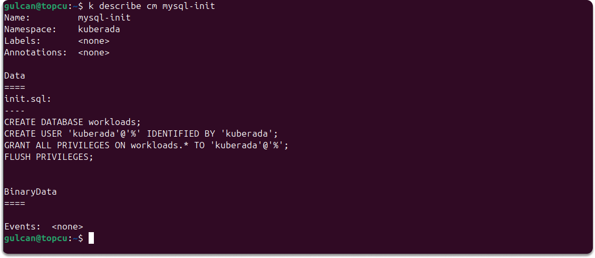

You can verify the database and user creation by connecting to the MySQL instance. 

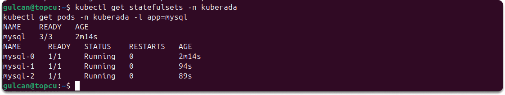

In this StatefulSet, we automated a 3-replica MySQL cluster with stable network identities, ordered deployment, persistent storage, and an initialization script for setting up the database workloads and user kuberada. 

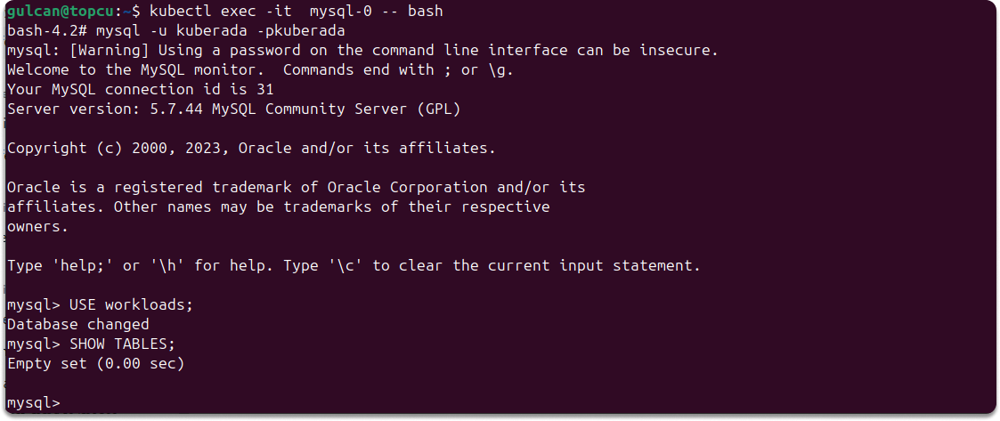


#### One-Time Tasks (Job)

Let's say you must send your team a critical one-time email notification about an upcoming system maintenance. Kubernetes Jobs are tailor-made for this scenario. 

A Job will spin up a single pod, execute the task of sending the email, and then gracefully terminate upon completion. There's no need to worry about restarts or ongoing management; the Job ensures your notification goes out once and only once.

```yaml
# One-Time Tasks (Job)
# Jobs run tasks to completion without restarting on failure.

apiVersion: batch/v1
kind: Job
metadata:
  name: email-job
spec:
  template:
    spec:
      containers:
      - name: email-container
        image: email-sender:latest  # Container image for the email sender.
        command: ["send-email"]  # Command to run in the container.
      restartPolicy: Never  # Job completes without restarting on failure.

```

This Job example demonstrates a simple yet powerful way to automate tasks within your Kubernetes environment. Whether it's sending notifications, performing data cleanup, or executing any other finite task, Jobs provide a reliable and efficient mechanism to ensure your operations run smoothly.

Let's shift our focus from one-time tasks to the broader landscape of Kubernetes workloads and their diverse applications.

The diagram below serves as a visual reference for the different Kubernetes workload types and their typical use cases, aiding your understanding as we explore practical examples.

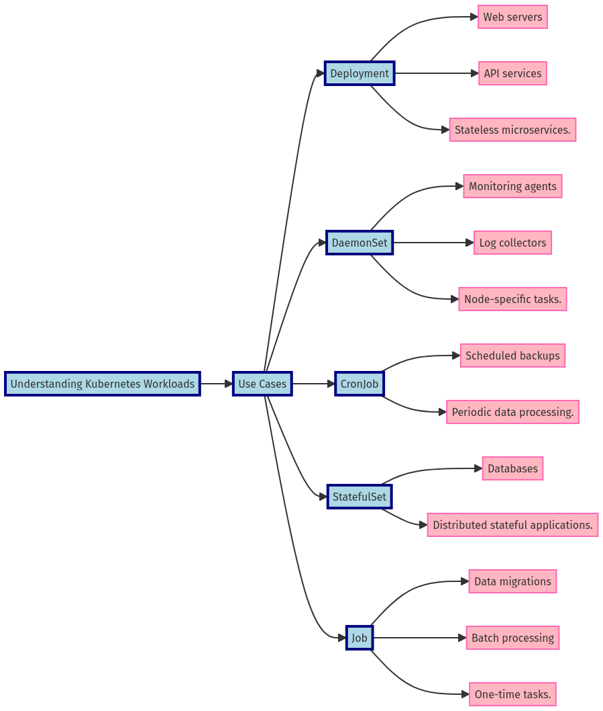

#### Decision Time: Your Kubernetes Workload Flowchart

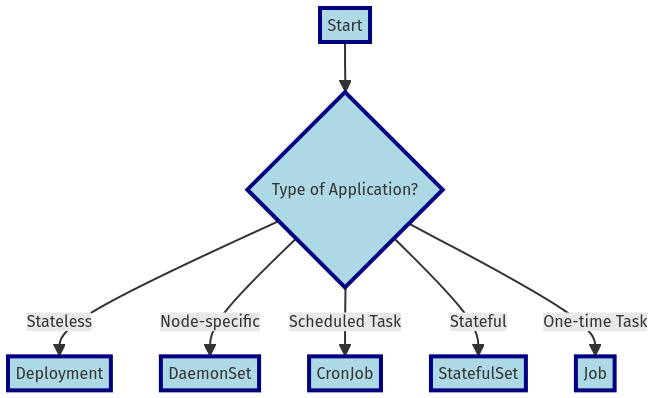

This flowchart can guide you through the decision-making process, asking key questions about your application's requirements to determine the most appropriate Kubernetes workload type.

## Workloads in Complex Production Environments

Let's consider how Kubernetes workloads are used in complex production environments.

Imagine an e-commerce platform during a high-traffic sales event. To manage the surge in user activity, the platform uses Deployments to scale web applications efficiently. StatefulSets ensure that databases remain reliable and data stays consistent despite the heavy load. Meanwhile, Jobs handle background tasks like order processing and data cleanup, ensuring these operations run smoothly without impacting the user experience.

In a microservices architecture, Kubernetes workloads are equally essential. Deployments manage stateless services such as user authentication and product catalogs, allowing these services to scale and update independently. StatefulSets manage stateful services like databases and message brokers, which need stable network identities and persistent storage. DaemonSets deploy logging and monitoring agents on every node, providing comprehensive system monitoring and log collection to maintain the architecture's health and performance.

These examples show how Kubernetes workloads optimize different parts of a production environment, ensuring performance, reliability, and scalability.


## Key Takeaways

Let's recap the essential lessons from this guide:

* Each workload type serves a specific purpose. Assess your application requirements carefully.
* Selecting the right workload type can optimize performance, resource utilization, and application stability.
* Implement Thoughtfully: Ensure your manifests are correctly configured to take full advantage of Kubernetes' capabilities.
* Monitor and Adapt: Continuously monitor your workloads and adapt as necessary to maintain optimal performance and resource usage.

Choosing the right Kubernetes workload can be daunting, but with this guide, you have the tools to make informed decisions that will set your applications up for success. 

Remember, the key to success is not just deploying workloads, but deploying them intelligently.

**Enjoyed this read?**

If you found this guide helpful, follow me on:

* [LinkedIn](https://www.linkedin.com/in/gulcantopcu/) to get the latest updates.
* [Medium](https://medium.com/@gulcantopcu) for even more Kubernetes insights and discussions.
* Kuberada, for in-depth articles.

Until next time, happy deploying!

<script src="https://utteranc.es/client.js"
        repo="colossus06/Kuberada-Blog"
        issue-term="pathname"
        label="blog"
        theme="github-light"
        crossorigin="anonymous"
        async>
</script>